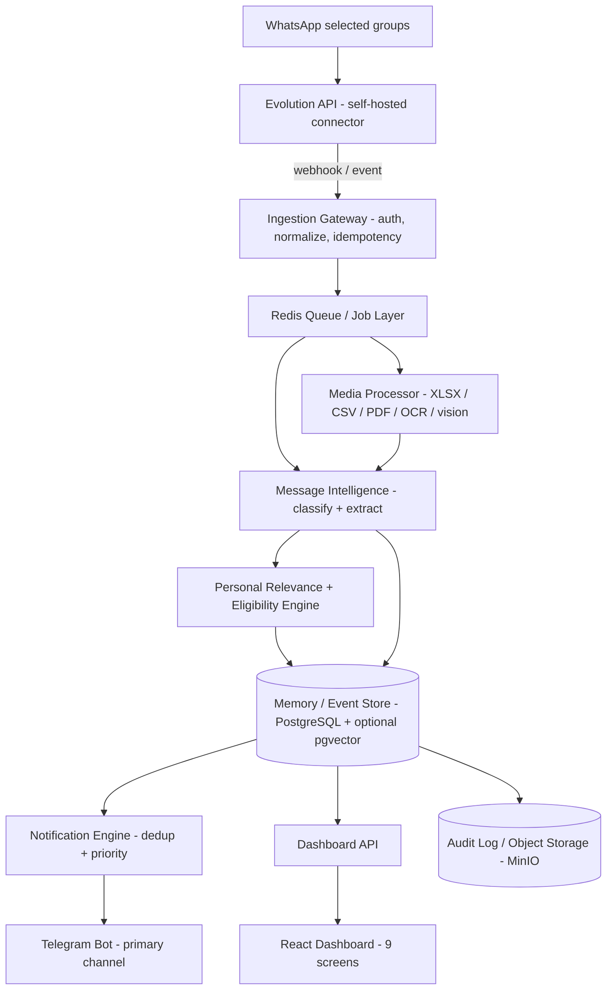
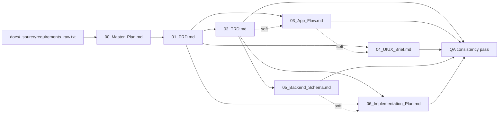

# PIA — Master Plan & Worker Coordination Contract

| | |
|---|---|
| Project | Placement Intelligence Agent (PIA) |
| Date | 2026-09-05 |
| Status | Authoritative planning baseline for all worker agents |
| Sources | `E:\agent\placement-intelligence\docs\_source\requirements_raw.txt` (two docs: **Master Requirements** v1.0 2026-08-24, authoritative; **Placement WhatsApp Assistant** for "Nitish", pragmatic/safety guidance) |
| Purpose | Single contract that 6 worker agents follow to produce docs 01–06 |

---

## 1. Project Understanding

PIA is a private, personal AI agent for a **single student (Nitish)** that continuously reads a small set of **selected WhatsApp placement/academic groups** through a self-hosted **Evolution API** connector and turns the noisy chat stream into personally relevant, persistent knowledge. It detects company eligibility lists delivered as text, Excel/CSV, PDF, or images/screenshots; checks whether Nitish's name/roll number appears using a deterministic-first matching ladder; **remembers** which companies he is eligible for; links every later mention of those companies back to that memory; extracts deadlines and placement events (registration, OA, interview, KYC session, venue changes); suppresses duplicate/reminder spam; and still surfaces important non-placement academic notices. Every alert is **evidence-backed** (links to the source message/document) and distinguishes observed facts from AI interpretation.

Core product promise: *"Tell me what matters to me, remember the context, and do not make me read the same thing twice."*

It is a **hybrid deterministic + AI platform**: code owns identity, timestamps, persistence, state transitions, deduplication, notification history, and safety; LLMs only interpret/extract/classify and their output is schema-validated before it can touch authoritative state. Deployment is personal (one user, Docker Compose, small VPS-class host), not multi-tenant SaaS. MVP is **read-and-notify only**: no outbound WhatsApp sends, no autonomous actions, no KYC/form automation.

---

## 2. Key Decisions (Decision Register)

Where the two source docs conflict, the **Master Requirements doc wins**, except where the leaner doc adds **safety/pragmatic guidance** (ban risk, Telegram, secondary number) — those are adopted and noted. No decision below contradicts ADR-001..010 of the master doc; they refine it.

### DEC-001 — Backend stack: Python 3.11+ / FastAPI
- **Decision:** Python 3.11+ with FastAPI for API + workers; React + TypeScript dashboard (unchanged).
- **Rationale:** Master doc Section 6 names Python + FastAPI as the baseline (authoritative). The leaner doc offered Node/TS *or* Python; Python directly fits pandas/openpyxl (Excel), PyMuPDF (PDF), and OCR/vision pipelines that dominate this product.
- **Consequence:** Worker docs specify Python tooling (pydantic v2 for schemas/validators, SQLAlchemy/Alembic, pytest, RQ/Celery-style Redis jobs). Type hints + mypy/ruff required.

### DEC-002 — Outbound notifications: Telegram bot primary, channel adapter pattern
- **Decision:** Telegram Bot API is the primary (and MVP-only) outbound channel behind a `NotificationChannel` adapter interface; email and WhatsApp-self adapters are specified as interfaces but not implemented in MVP.
- **Rationale:** Master F-024 implied "WhatsApp/self notification"; the leaner doc's reality check (Section 2/5) recommends Telegram precisely because it never touches the WhatsApp account for sending — lower ban risk. Adopted as safety guidance (allowed by the conflict rule).
- **Consequence:** Notification *decisioning* is channel-agnostic; delivery adapters are pluggable. No WhatsApp outbound sends exist anywhere in MVP code.

### DEC-003 — WhatsApp interaction mode: read-only monitoring only
- **Decision:** MVP interacts with WhatsApp **read-only** (receive messages/media; no sends, no replies, no reads/receipts triggers beyond passive). A **secondary WhatsApp number** linked to Evolution API is the documented recommendation for the connection; the primary number is discouraged.
- **Rationale:** Leaner doc Sections 2 and 7 (unofficial Baileys protocol, non-zero ban risk; read-only monitoring of groups the account genuinely belongs to is the lowest-risk pattern). Consistent with master core principle "act only with explicit approval in later phases".
- **Consequence:** No send-capability in the connector; docs must carry the secondary-number recommendation and a "silence is detected, not assumed" health check (last-message-received-at, per leaner doc Section 7).
- **Update 2026-09-05 (owner decision):** Nitish explicitly chose to link the **primary number**. Recorded as an accepted-risk owner decision overriding the recommendation. Standing mitigations remain mandatory: read-only operation, zero outbound sends, silence health-check, and instant unlink capability. If WhatsApp shows any warning sign, unlink immediately and move to a secondary number before re-pairing.

### DEC-004 — MVP scope: P0–P11; P12–P14 explicitly out of MVP
- **Decision:** MVP = master phases **P0–P11** (foundation → connector → persistence → basic intelligence → profile → document intelligence → eligibility engine → company memory → event/deadline engine → semantic dedup → notification engine → dashboard), which satisfies the master MVP Release Gate (Section 26). **P12 (conversational search), P13 (action preparation), P14 (controlled automation) are out of MVP** and specified only as future scope. `ACTION_AUTOMATION_ENABLED=false` permanently in MVP.
- **Mapping of leaner doc Phase 0–5 onto P0–P14:** leaner Phase 0 → P0+P1+P2; Phase 1 (daily digest) → P3 (partial) + P10 digest slice; Phase 2 → P5+P6; Phase 3 → P7+P8; Phase 4 (dedup polish) → P9 (may be interleaved per risk notes, see 06); Phase 5 (form-fill assistance) → P13/P14 — out of MVP.
- **Rationale:** Master doc is authoritative on scope; its MVP gate requires exactly the P0–P11 capability set. The leaner doc's sequencing is value-first guidance, preserved in the implementation plan's demo checkpoints.
- **Consequence:** 01_PRD and 06_Implementation_Plan scope everything to P0–P11; anything from P12–P14 appears only in a "Future scope" section.

### DEC-005 — Data & infrastructure: PostgreSQL (+ optional pgvector), Redis queue, MinIO/S3, Docker Compose
- **Decision:** PostgreSQL 15+ is the single authoritative store (ADR-002); pgvector optional for semantic retrieval only, never authoritative (ADR-003); Redis-backed job queue with retries + dead-letter queue; MinIO (S3-compatible) for media/documents; Docker Compose for local dev and deployment.
- **Rationale:** Master doc Sections 6 and 9; leaner doc agrees (Evolution API already uses PostgreSQL — one DB).
- **Consequence:** 05_Backend_Schema targets PostgreSQL DDL; 02_TRD defines the compose service list (api, worker, postgres, redis, minio, evolution-api, dashboard).

### DEC-006 — LLM layer: provider-agnostic abstraction, schema-validated, never state-mutating
- **Decision (updated 2026-09-05, P3 kickoff):** A provider-agnostic LLM client interface (structured JSON output against pydantic schemas, with validation + retry-on-invalid). **Provider: NVIDIA NIM hosted API** (`https://integrate.api.nvidia.com/v1`, OpenAI-compatible) via the `openai_compatible` adapter. **Models chosen by bake-off on the live key (2026-09-05):** text = `mistralai/mistral-nemotron` (6/6 valid JSON, best label accuracy, ~1.3 s avg), vision = `meta/llama-3.2-11b-vision-instruct` (8/8 rows extracted from a synthetic eligibility list, Nitish + reg-no matched, 6.6 s). `meta/llama-3.3-70b-instruct` and `nvidia/llama-3.3-nemotron-*` are NOT available on this account; `meta/llama-3.2-90b-vision-instruct` timed out twice under free-tier load. Hosted free-tier endpoints are flaky (timeouts/503/404 observed) — therefore LLM calls are always optional enhancement with deterministic rule-based fallback (ADR-004 posture). Model output never mutates authoritative state directly — a validator/state-transition layer consumes it.
- **Rationale:** Owner choice (NVIDIA NIM) + evidence-based bake-off on the live key. A vision-capable model is required by the FR-ELG-004 image path; the 11B vision model met the extraction bar exactly where the 90B was unavailable.
- **Consequence:** 02_TRD defines the schemas per AI task and the provider interface; 05_Backend_Schema includes an AI-call log table (provider, latency, token usage, validation result — no sensitive content, per master Section 14).

### DEC-007 — Monorepo layout
- **Decision:** Single monorepo exactly as master F-001: `apps/api` (FastAPI), `apps/worker` (job consumers), `apps/dashboard` (React+TS), `packages/shared` (schemas, domain types, normalization utilities), `infrastructure` (docker-compose, env templates, migrations runner), `tests` (unit/fixture/integration/e2e), `docs`.
- **Rationale:** Master Section 19 F-001; keeps the solo-developer workflow simple while preserving service boundaries.
- **Consequence:** 06_Implementation_Plan and 02_TRD use these paths; no polyrepo.

### DEC-008 — KYC: detection and reminders in scope; KYC automation permanently excluded
- **Decision:** KYC **sessions are detectable events** with reminders (FR-EVT-001 event type; P13 detection is future scope). **Automating KYC attendance/submission is excluded — not just from MVP, but from the product roadmap entirely.**

**Amendment 2026-09-06 (owner decision, refines the scope):** KYC occurs twice — (1) an **informational company-arrival session** (no attendance register, no fine, feedback form filled manually by the owner) and (2) a **post-shortlist session** for selected candidates. For (2), automation is permanently excluded and attendance is always manual — it carries personal/evaluative value and identity stakes. For (1), the owner explicitly permits a **personal automated listener**: joining via the owner's own Microsoft credentials, capturing a summary (company, designation discussed) and the feedback-form link (relayed so the owner fills it personally), then leaving. Reminders and dossiers apply to both. The informational session has no attendance register to falsify and the owner consumes the intended benefit, so the misrepresentation concern does not arise there; the post-selection session remains the ethical line.
- **Rationale:** Leaner doc Phase 5 and Section 7: a KYC session exists to verify identity; automating it misrepresents identity — an ethical line, not a convenience trade-off. Consistent with master ADR-008 (irreversible actions require approval).
- **Consequence:** 01_PRD non-goals and 02_TRD action-engine guardrails must state this explicitly; no worker doc may design KYC automation.

### DEC-009 — Deduplication: adopt leaner-doc enhancements under FR-DED-*
- **Decision:** Semantic dedup design (FR-DED-001..005, canonical events per ADR-006) additionally adopts: **perceptual hashing (pHash)** for re-forwarded/re-compressed screenshot recognition and a **time-window rule** (same content reappearing after ~7 days is a legitimate reminder, not noise, and may re-notify per escalation policy).
- **Rationale:** Leaner doc Phase 4 adds concrete, non-contradicting mechanisms; master requires the outcome (FR-DED-*, NFR-005) without prescribing these details.
- **Consequence:** 02_TRD dedup section and 05_Backend_Schema (content_hash + image_phash columns) incorporate both.

### DEC-010 — Summary fallback ladder + NIM primary model swap (2026-09-12/13)
- **Decision:** The KYC meeting summary (and any best-effort LLM path) now runs a four-rung ladder, each rung tagging its source in the Telegram message: **NIM (structured, primary) → OpenRouter → Groq → honest raw transcript**. On the owner's explicit order, the sequence is NIM first, then OpenRouter, then Groq. All three providers are used on **free tiers**. The NIM primary text model is swapped from `mistralai/mistral-nemotron` to **`nvidia/nemotron-3-super-120b-a12b`** (schema-valid JSON in 4.3 s vs. the old model timing out at 90 s live); OpenRouter uses `inclusionai/ling-3.0-flash-vl:free`; Groq uses `openai/gpt-oss-120b` (1K req / 200K tokens/day free). Provider keys live only in `infrastructure/.env` (SEC-001); a provider 402/429/timeout fails over to the next rung automatically.
- **Rationale:** DEC-006 already mandated a provider-agnostic, schema-validated, never-state-mutating LLM layer with a deterministic fallback; NIM's free tier is flaky (observed live: timeouts, and a summary that fell through to raw). Adding cheap, independent free providers raises the chance a *summarized* (not raw) result reaches Telegram without any paid dependency, per the owner's request.
- **Consequence:** New settings `openrouter_*`/`groq_*` + `LLM_MODEL` default; `teams/listener.py` `_summarize` extended; `tests/unit/test_listener_summary.py` covers ladder order + final fallback offline; `02_TRD` §4.1 and env.example reflect the chain. No schema/DB change.

---

## 3. Architecture Summary

The pipeline follows master doc Section 5 exactly: Evolution API (self-hosted, Baileys-based, replaceable adapter per ADR-001) fires webhooks on group events; the **Ingestion Gateway** authenticates/verifies, normalizes to a canonical internal message schema, enforces idempotency (FR-MSG-002), and persists the raw payload with retention (FR-MSG-003). Jobs go onto a **Redis queue**; the **Media Processor** downloads and parses XLSX/CSV/PDF/image attachments into normalized candidate rows with page/sheet evidence; **Message Intelligence** classifies domain/importance and extracts entities (companies, dates, links, actions) via schema-validated LLM calls with rule-based overrides. The **Eligibility Engine** runs the identity matching ladder against the candidate profile and produces a `MatchResult` (master Section 8.2); the **Memory/Event Store** (PostgreSQL, authoritative) persists eligibility records, canonical events, deadlines, and company memory; the **Notification Engine** computes personal relevance, suppresses duplicates against canonical events and delivery history, and delivers via **Telegram**; the **Dashboard API + React app** expose evidence-backed state, and the user can correct matches (supervised feedback).

Boundary rule (master 5.1): each component owns exactly its listed responsibility and "must not own" column — e.g., Media Intelligence never decides final identity; the Notification Engine never reinterprets raw files; the LLM never mutates state.

---

## 4. Documentation Plan & Worker Task Assignments

Shared inputs for **all** workers (fresh context — read both before writing):
- `E:\agent\placement-intelligence\docs\_source\requirements_raw.txt` (both source docs)
- `E:\agent\placement-intelligence\docs\00_Master_Plan.md` (this file — the decision register is binding)

All outputs go to `E:\agent\placement-intelligence\docs\`. Every worker must include a short "Traceability" table mapping its content to source IDs (FR-* / US-* / SEC-* / NFR-* / ADR-* / P* / F-*) and an "Open Questions" appendix for genuine ambiguities (do not guess).

### Work Order W1 — `01_PRD.md` (Product Requirements Document)
- **Purpose:** Single authoritative product contract consolidating both source docs: what PIA does for Nitish, in scope for MVP (P0–P11 per DEC-004), and how success is measured.
- **Required sections & guidance:**
  1. *Executive summary* — 1 page; merge master §1 with leaner §1; state the personal, read-only, single-user nature (DEC-003).
  2. *Problem statement* — noisy placement groups; missed eligibility lists/deadlines; repeated reading.
  3. *Persona* — "Nitish", single final-year student; include data he prepares upfront (leaner §6: name variants, roll/registration number, CGPA, branch, batch, Telegram account).
  4. *Goals / non-goals* — master §2 verbatim in substance; add non-goals: outbound WhatsApp sends, KYC automation (DEC-008), P12–P14 features.
  5. *User stories* — consolidate **US-01..09** (master §3) with Given/When/Then acceptance criteria derived from each "Success outcome".
  6. *Functional requirements* — consolidate **FR-WA-001..006, FR-MSG-001..004, FR-CLS-001..004, FR-PRO-001..004, FR-ELG-001..009, FR-MEM-001..005, FR-EVT-001..005, FR-DED-001..005, FR-NOT-001..007** with IDs, MUST/SHOULD priority, description, and acceptance criteria **kept stable — never renumber or rename IDs**. Reflect DEC-002 (notification channel-agnostic) and DEC-009 within existing IDs.
  7. *MVP scope* — P0–P11 feature map; explicit out-of-scope list (P12–P14, KYC automation, WhatsApp outbound).
  8. *Success metrics* — from master §14 core metrics + NFR-001..009 targets, phrased user-measurably.
  9. *Notification policy summary* — reproduce master §11 priority table (CRITICAL/HIGH/MEDIUM/LOW/IGNORE with delivery + dedup rules) and the §11.1 template contract.
  10. *Risks* — merge master §23 with leaner §7 (ban risk, OCR misreads, silence-vs-no-updates, form-fill errors).
  11. *MVP release gate* — reproduce master §26 as a checklist.
- **Inputs:** both shared inputs only.
- **Output:** `E:\agent\placement-intelligence\docs\01_PRD.md`
- **Definition of done:** every FR/US/SEC/NFR ID from the master doc appears exactly once with stable ID and priority; no new requirements invented; contradictions resolved per Section 2 of this plan; ~concise enough to read in 20 minutes; tables render cleanly.
- **Dependencies:** none (Wave 1). All other docs consume this.

### Work Order W2 — `02_TRD.md` (Technical Requirements Document)
- **Purpose:** How the system is built: components, contracts, algorithms, controls — the engineering counterpart to 01_PRD.
- **Required sections & guidance:**
  1. *Architecture overview* — narrative matching this plan's Section 3 and master §5/§5.1; component boundary table including "must not own" column.
  2. *Tech stack & rationale* — per DEC-001..007 (Python 3.11+/FastAPI, PostgreSQL+pgvector optional, Redis, MinIO, React+TS, Docker Compose, Telegram adapter); cite ADRs.
  3. *API design* — evolve master §16 contract: keep all 15 endpoints, add request/response envelope, error model, pagination, auth posture (see Open Questions Q3), and additive endpoints the dashboard needs (e.g., documents/extractions listing) clearly marked as additions.
  4. *AI/LLM layer* — structured output schema (JSON Schema or pydantic) for each of the 7 master §12 AI tasks; validator layer; null-when-unknown policy; provider abstraction interface (DEC-006); retry/timeout/token-budget policy; rule-based override precedence (FR-CLS-004).
  5. *Media pipeline per input type* — master §8 table (primary parser/fallback/required output) as concrete pipeline steps; `CandidateRow` (§8.1) contract; failure branches (download retry FR-WA-006, low-confidence OCR → review).
  6. *Identity matching ladder* — EXACT → NORMALIZED → IDENTIFIER → FUZZY → MODEL_REVIEW; `MatchResult` contract (§8.2); threshold governance per ADR-009 (thresholds from evaluation data, not invented); AMBIGUOUS never auto-confirms (ADR-005, NFR-006).
  7. *Dedup design* — content hash, near-duplicate similarity, semantic fact comparison, canonical events (ADR-006), pHash + 7-day window (DEC-009), information delta (FR-DED-004).
  8. *Notification engine* — priority policy §11, dedup keys, escalation windows (FR-NOT-005), digest composition (FR-NOT-006), delivery history, evidence attachment (FR-NOT-007), template rendering.
  9. *Security & privacy controls* — one concrete mechanism per **SEC-001..009** (e.g., SEC-003 webhook signature + rate limit; SEC-002 encryption-at-rest approach; SEC-007 retention jobs; SEC-009 evidence labeling).
  10. *Observability* — correlation IDs on every inbound message; per-job retry count/error class; AI call logging (DEC-006); the full §14 metrics list; DLQ behavior; `/health` composition (API, DB, queue, Evolution connection, worker).
  11. *Deployment topology* — docker-compose service list + responsibilities; env vars from master §22.
  12. *Performance targets* — table mapping **NFR-001..009** to design mechanisms and measurable targets.
- **Inputs:** shared inputs + `E:\agent\placement-intelligence\docs\01_PRD.md`.
- **Output:** `E:\agent\placement-intelligence\docs\02_TRD.md`
- **Definition of done:** every SEC-* and NFR-* mapped to a control/target; every AI task has a schema; no design contradicts ADR-001..010; component boundaries table complete; a reviewer could start P0 from this doc.
- **Dependencies:** 01_PRD (hard).

### Work Order W3 — `03_App_Flow.md` (App Flow)
- **Purpose:** End-to-end runtime behavior: what happens, in what order, including failures — the bridge between PRD intent and TRD components.
- **Required sections & guidance:** For each flow: a mermaid sequence or flowchart diagram + a step table (step | actor | system/component | action | output/state | evidence). **Error/retry branches are mandatory, not optional.**
  1. *Onboarding* — pair WhatsApp instance via Evolution API (QR), connection state persistence (FR-WA-001), group discovery + allowlist selection (FR-WA-004), profile setup with aliases/identifiers (FR-PRO-001/002), Telegram bot connect.
  2. *Message ingestion* — webhook verification → normalize → idempotency check → queue → processing states (master §10.1); branches: duplicate delivery, invalid signature, queue failure.
  3. *Media/document processing* — per input type (XLSX/CSV/PDF/scanned PDF/image); branches: download failure → retryable job (FR-WA-006), OCR low confidence → vision fallback → manual review state.
  4. *Eligibility detection & matching* — list detection (FR-ELG-001) → parse → normalize → matching ladder; branches: MATCHED (auto), AMBIGUOUS (→ user review, never auto-confirm), NOT_FOUND (≠ NOT_ELIGIBLE, FR-ELG-009), INVALID_SOURCE.
  5. *Company memory linkage* — new company vs existing alias resolution (FR-MEM-001/003), watch state activation (FR-MEM-005).
  6. *Event/deadline lifecycle* — detection → canonical event → delta update (FR-EVT-004) → deadline states (§10.3); hallucination guard (FR-EVT-005: missing date stays unknown).
  7. *Notification decisioning* — relevance scoring → priority → dedup check → immediate vs digest vs suppress (§11); escalation branch.
  8. *Daily digest* — composition from canonical events only; contains only new/actionable items.
  9. *User correction/feedback* — false match / false negative correction (FR-PRO-004); state rollback per §10.2 (ELIGIBLE → SUPERSEDED etc.); audit trail.
  10. *Dashboard navigation* — screen-to-flow map showing which flows surface on which of the 9 screens.
- **Inputs:** shared inputs + `01_PRD.md` (hard); `02_TRD.md` if available (component names) — otherwise use this plan's Section 3 component names.
- **Output:** `E:\agent\placement-intelligence\docs\03_App_Flow.md`
- **Definition of done:** every FR-* group has ≥1 flow reference; all four state machines (master §10.1–10.4, action lifecycle marked future) appear in flows; every flow has at least one error branch; the golden end-to-end scenario (master §20.2, Accenture example) is rendered as one flagship sequence diagram.
- **Dependencies:** 01_PRD (hard); 02_TRD (soft).

### Work Order W4 — `04_UIUX_Brief.md` (UI/UX Brief)
- **Purpose:** Design specification for the React dashboard and notification templates so a frontend builder can implement without inventing UX.
- **Required sections & guidance:**
  1. *Design principles* — personal relevance over volume; evidence over confidence theater (SEC-009: visually distinguish observed facts vs AI interpretation); calm-by-default (suppressed noise visible but quiet).
  2. *Information architecture* — the **9 screens from master §17** (Overview, Companies, Timeline, Inbox, Documents, Notifications, Profile, Settings, Audit) with a nav map.
  3. *Per-screen spec* — purpose, key components, priority content, primary action(s) per screen, per the "Must show" column of §17.
  4. *Evidence & confidence visualization* — how `MATCHED / NOT_FOUND / AMBIGUOUS / INVALID_SOURCE` statuses and `match_method`/confidence render (badge + confidence indicator + evidence links to source message/document page/sheet/row); how AMBIGUOUS invites user review (from §10.2).
  5. *Notification template rendering* — mockups of the §11.1 template contract (Title / What changed / Why it matters / Deadline / Action / Source / Confidence) in Telegram message form, per priority level.
  6. *Tone & voice* — concise, factual, no alarmism; "evidence-backed, not confident-sounding".
  7. *States* — empty, loading, error, stale-connection (Evolution API health) for key screens.
  8. *Accessibility* — WCAG AA contrast for status/priority colors; keyboard navigation; screen-reader labels for confidence/evidence.
  9. *Responsive behavior* — desktop-first dashboard, usable down to mobile widths; Telegram carries the mobile-first burden.
  10. *Suggested design tokens* — color scale for priorities (CRITICAL..IGNORE), status colors (MATCHED/AMBIGUOUS/NOT_FOUND), typography scale, spacing.
- **Inputs:** shared inputs + `01_PRD.md` (hard); `03_App_Flow.md` if available (states/branches) — otherwise derive from master §10/§11.
- **Output:** `E:\agent\placement-intelligence\docs\04_UIUX_Brief.md`
- **Definition of done:** all 9 screens covered with purpose + components; SEC-009 fact-vs-interpretation distinction visible in concrete UI patterns; no flow contradicts 03_App_Flow; ASCII or mermaid mockups for at least Overview and Documents screens.
- **Dependencies:** 01_PRD (hard); 03_App_Flow (soft).

### Work Order W5 — `05_Backend_Schema.md` (Backend Schema)
- **Purpose:** Complete, implementable PostgreSQL schema for all master §9 entities — the single source of truth for migrations.
- **Required sections & guidance:**
  1. *Conventions* — UUID PKs, `created_at/updated_at`, snake_case, soft-delete policy, timezone-aware timestamps (store UTC, render Asia/Kolkata per §22).
  2. *Full DDL* — `CREATE TABLE`-style definitions for: `users`, `candidate_profiles`, `identity_aliases`, `whatsapp_instances`, `groups`, `messages`, `attachments`, `document_extractions`, `companies` (+ `company_aliases`), `eligibility_records`, `events`, `event_updates`, `deadlines`, `notifications`, `memory_records`, `actions` (future, schema defined now), `audit_logs`, plus job tables (`job_records`, `dead_letter_queue`) and `idempotency_keys`.
  3. *Enums & state machine columns* — message processing states (§10.1), eligibility states (§10.2), event lifecycle (§10.3), action lifecycle (§10.4, future), deadline states, notification statuses; document allowed transitions per state machine.
  4. *Indexes & constraints* — unique `provider_message_id` (+ group) for idempotency, `content_hash`, event `canonical_key`, notification `dedup_key`, FK indexes; justify each index by a query from the §16 API contract.
  5. *Idempotency design* — key construction rules and upsert semantics supporting FR-MSG-002 / NFR-002.
  6. *Retention policy fields* — per SEC-007: `retention_expires_at` / raw-payload tables for messages, media, model artifacts; configurable periods from §22.
  7. *pgvector usage notes* — optional embedding table(s), what gets embedded, and the hard rule: never authoritative for eligibility/deadlines (ADR-003).
  8. *ERD* — mermaid `erDiagram` covering all tables.
  9. *Migration strategy* — Alembic, forward-only with reversible where practical (master DoD), seed/fixture data strategy for tests.
- **Inputs:** shared inputs + `02_TRD.md` (hard — component/idempotency/dedup designs); `01_PRD.md` (FR references).
- **Output:** `E:\agent\placement-intelligence\docs\05_Backend_Schema.md`
- **Definition of done:** every §9 entity has a table with key fields from the master table; all enums map to §10 state machines; DDL is valid PostgreSQL 15+; ERD matches the DDL; every index justified; retention and idempotency explicitly designed.
- **Dependencies:** 02_TRD (hard); 01_PRD (soft).

### Work Order W6 — `06_Implementation_Plan.md` (Implementation Plan)
- **Purpose:** Turn P0–P14 / F-001–F-031 into an actionable, solo-developer-ready build sequence for the MVP.
- **Required sections & guidance:**
  1. *Milestone map* — consolidate master §18/§19 into MVP milestones P0–P11 with a **suggested week-by-week timeline for one solo developer** (envelope: 10–16 weeks total; e.g., P0 ≈1wk, P1 ≈1wk, P2 ≈1wk, P3 ≈1–1.5wk, P4 ≈0.5–1wk, P5 ≈2wk, P6 ≈1.5wk, P7 ≈1wk, P8 ≈1.5wk, P9 ≈1wk, P10 ≈1.5wk, P11 ≈2wk — adjust with justification). Show leaner-doc Phase 0–5 mapping (DEC-004) as a column.
  2. *Per-milestone task breakdown* — map each **F-001..F-031** to its milestone with concrete tasks, acceptance criteria, and **traced FR IDs**; P12–P14/F-028..F-031 listed as explicitly deferred.
  3. *Test strategy per phase* — apply master §20 layers (unit, fixture, integration, e2e, AI regression, safety, chaos) to each milestone; include the golden E2E scenario (§20.2) as the P10/P11 capstone test.
  4. *DoD checklist* — reproduce master §21 as the per-feature gate.
  5. *CI/CD* — pipeline stages: lint (ruff), type check (mypy), tests, secret scanning (SEC-001/NFR-008), docker build; branch/PR conventions for a solo dev.
  6. *Local dev setup* — clone → `docker compose up` → env vars (master §22) → Evolution API pairing → run tests; document the secondary-number recommendation (DEC-003).
  7. *Risk-based reordering notes* — where the leaner doc's value-first order suggests deviation (e.g., early digest value, dedup polish interleaved as in its Phase 4), note that ADR-010 requires strict phase order **unless recorded as a justified ADR amendment**; provide the proposed amendment text rather than silently reordering.
  8. *Demo checkpoints* — one runnable demo per milestone (e.g., P2: "10 duplicate webhooks → 1 row"; P6: ambiguous fixture never auto-confirms).
- **Inputs:** shared inputs + `01_PRD.md` (hard) + `02_TRD.md` (hard); `05_Backend_Schema.md` if available (soft — schema work is itself part of P0/F-002).
- **Output:** `E:\agent\placement-intelligence\docs\06_Implementation_Plan.md`
- **Definition of done:** every F-001..F-031 assigned (to a milestone or "deferred"); every milestone has exit criteria + demo + test strategy; every task traces to ≥1 FR ID; timeline totals are realistic for a solo dev; ADR-010 respected; MVP release gate (§26) mapped to the milestone that satisfies each gate item.
- **Dependencies:** 01_PRD + 02_TRD (hard); 05_Backend_Schema (soft).

### Final step — QA consistency pass (coordinator or a 7th worker)
Cross-check docs 01–06 for: stable FR/US/SEC/NFR/F/P IDs; no contradictions with ADR-001..010 or the DEC register; consistent component names, state names, and enum values (esp. between 02, 03, 05); consistent MVP boundary (P0–P11); consistent notification channel (Telegram primary). Fix discrepancies in the owning doc, or log as open questions.

---

## 5. Execution Order & Dependency Graph

- **Wave 1:** `01_PRD.md` (everything consumes it).
- **Wave 2 (parallel):** `02_TRD.md`, `03_App_Flow.md`, `04_UIUX_Brief.md`.
- **Wave 3 (parallel):** `05_Backend_Schema.md`, `06_Implementation_Plan.md`.
- **Wave 4:** QA consistency pass across all six.

Solid arrows = hard dependency (input must exist); dotted = soft (use if available, else proceed from master plan Section 3).

---

## 6. Conventions (binding for all worker agents)

1. **Format:** Markdown with mermaid diagrams (flowchart/sequence/erDiagram); UTF-8; English.
2. **Traceability:** every requirement, decision, and design point cites its source ID (`FR-*`, `US-*`, `SEC-*`, `NFR-*`, `ADR-*`, `P*`, `F-*`, `DEC-*`). IDs are stable — never renumber, rename, or merge them.
3. **No invented requirements:** do not add capabilities that contradict or extend beyond the source docs; refinements are allowed only if consistent with the DEC register and ADR-001..010.
4. **Ambiguity:** record in a short "Open Questions" appendix in the worker's own doc (and flag to the coordinator) — never silently guess on anything user-facing, security-related, or ethical.
5. **Date:** 2026-09-05. **Project name:** Placement Intelligence Agent (PIA). **User:** Nitish (single user).
6. **Tone:** build-ready and specific; tables over prose for structured content; no marketing language.
7. **Header block:** each doc starts with title, date, version 1.0-draft, source references, and its dependency list.

---

## 7. Open Questions (flag to user; do not block Wave 1–2)

| # | Question | Default assumption until answered |
|---|----------|-----------------------------------|
| Q1 | Exact LLM provider, model tier, and monthly budget? (affects vision/OCR fallback volume) | Anthropic Claude default per leaner doc; OpenAI-compatible fallback configurable (DEC-006) |
| Q2 | Hosting: small VPS vs home server; budget/region? (Evolution API must run continuously) | Small VPS, Asia/Kolkata timezone (`APP_TIMEZONE` per master §22) |
| Q3 | Dashboard auth needed for single-user local deployment? | Yes — minimal single-credential/token auth anyway (SEC-002 posture); no multi-user |
| Q4 | Which Evolution API version to pin, and its exact webhook payload schema? (master §23/§27: pin tested version; check LICENSE/TRADEMARKS attribution duties) | Pin latest stable at P1 start; verify license compliance before any distribution |
| Q5 | Does Nitish already have a secondary WhatsApp number, and which groups is it a member of? (group JIDs unknown until P1) | Secondary number recommended; allowlist configured at onboarding (FR-WA-004) |
| Q6 | Telegram bot token setup confirmed? Any need for an email fallback channel in MVP? | Telegram only in MVP (DEC-002); email deferred |
| Q7 | Retention defaults: `RAW_MESSAGE_RETENTION_DAYS`, `DOCUMENT_RETENTION_DAYS`, `MEDIA_MAX_SIZE_MB`? | Decide in 02_TRD with a sensible personal-deployment default; configurable per §22 |
| Q8 | Source of evaluation data for `FUZZY_MATCH_THRESHOLD` / `AMBIGUOUS_MATCH_THRESHOLD` (ADR-009 forbids invented constants)? | Build fixture corpus in P5/P6; thresholds tuned and documented there |

**Resolved 2026-09-05 (owner answers):**
- **Q1 → NVIDIA NIM hosted API** (see updated DEC-006). Create the NVIDIA API key before P3; exact model IDs pinned at P3 kickoff. A vision-capable model (`LLM_VISION_MODEL`) is mandatory for the FR-ELG-004 image path.
- **Q2 → Cheap VPS** (~2 GB RAM, always-on; Docker Compose deployment documented for VPS with Caddy TLS).
- **Q5 → Owner chose the primary WhatsApp number** (see DEC-003 update; accepted-risk decision with enforced mitigations).
- **Q6 → Telegram confirmed** by owner; bot token + chat id created during setup.
- **Still open:** Q3 (default applies: single bearer token), Q4 (pin Evolution version at P1 — repo analysis on 2026-09-05 confirmed: webhook events + apikey header + signature validation + S3/MinIO media + PostgreSQL via Prisma; Apache 2.0 with branding/usage-notification conditions; ~9.5k stars; anonymous telemetry can be disabled), Q7 (defaults proposed in 02_TRD §11), Q8 (P5/P6 fixture evaluation).

---

*End of master plan. Workers: execute your work order exactly; when done, report output path + any open questions raised.*
