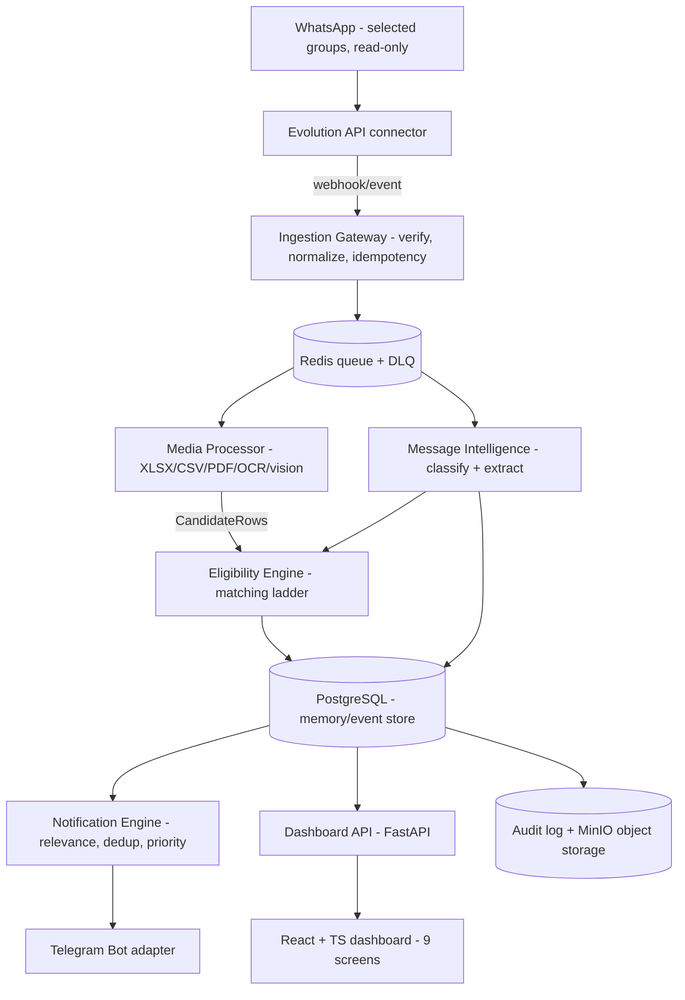

# 02 — Technical Requirements Document (TRD)

| | |
|---|---|
| Project | **Placement Intelligence Agent (PIA)** |
| Document | Technical Requirements Document |
| Version | 1.0-draft |
| Date | 2026-09-05 |
| Depends on | `01_PRD.md` (hard), `00_Master_Plan.md` DEC-001..009 (binding) |
| Consumed by | `03_App_Flow.md`, `04_UIUX_Brief.md`, `05_Backend_Schema.md` (hard), `06_Implementation_Plan.md` (hard) |

---

## 1. Architecture Overview

PIA is a hybrid deterministic + AI pipeline. **Code owns** identity, timestamps, persistence, state transitions, deduplication, notification history, permissions, and safety. **LLMs own** interpretation only — classification, entity extraction, document understanding, semantic matching — and their structured output is schema-validated by a deterministic validator layer before it can influence state (ADR-004).

The runtime pipeline (master §5, DEC-005/006):

1. **Evolution API** (self-hosted, Baileys-based, read-only usage per DEC-003) receives WhatsApp group messages and fires a webhook per event.
2. **Ingestion Gateway** (FastAPI) authenticates/verifies the webhook (SEC-003), normalizes the provider payload to the canonical internal message schema (FR-MSG-001), enforces idempotency (FR-MSG-002), and persists the raw payload under retention (FR-MSG-003).
3. **Redis job layer** fans out per-message work (media processing, classification) with retries, backoff, and a dead-letter queue.
4. **Media Processor** downloads and parses XLSX/CSV/PDF/images into normalized candidate rows with page/sheet/region evidence (FR-ELG-002..004).
5. **Message Intelligence** classifies domain/importance (FR-CLS-001/002) and extracts entities (FR-CLS-003) via schema-validated LLM calls with rule-based overrides (FR-CLS-004).
6. **Eligibility Engine** runs the identity matching ladder against the candidate profile and produces a `MatchResult` (§6 below).
7. **Memory/Event Store** (PostgreSQL, authoritative per ADR-002) persists eligibility records, canonical events, deadlines, company memory, and the audit log.
8. **Notification Engine** computes personal relevance (FR-NOT-001), applies the priority/dedup policy (§8), and delivers via the **Telegram adapter** (DEC-002).
9. **Dashboard API + React app** expose every decision with evidence and accept match corrections (FR-PRO-004).



### 1.2 State machines (master §10 — full definitions in 05_Backend_Schema §2)

| Machine | States | Allowed transitions (binding for all components) |
|---|---|---|
| Message processing (§10.1) | RECEIVED, VALIDATED, QUEUED, PROCESSING, PROCESSED, FAILED, RETRYING | RECEIVED→VALIDATED→QUEUED→PROCESSING→PROCESSED · PROCESSING→RETRYING→PROCESSING · PROCESSING/RETRYING→FAILED (terminal, requires visible reason; retries use backoff + DLQ) |
| Eligibility (§10.2) | UNKNOWN, MATCHED, NOT_FOUND, AMBIGUOUS, USER_CONFIRMED, ELIGIBLE, NOT_ELIGIBLE, EXPIRED, SUPERSEDED | UNKNOWN→MATCHED→ELIGIBLE · UNKNOWN→NOT_FOUND · UNKNOWN→AMBIGUOUS→USER_CONFIRMED→ELIGIBLE · ELIGIBLE→SUPERSEDED/EXPIRED on new authoritative evidence. **No AMBIGUOUS→ELIGIBLE edge** (ADR-005) |
| Event lifecycle (§10.3) | DETECTED, ACTIVE, COMPLETED, CANCELLED, EXPIRED | DETECTED→ACTIVE→COMPLETED/CANCELLED/EXPIRED · ACTIVE→ACTIVE via delta update (UPDATED modeled as `event_updates` rows) |
| Action lifecycle (§10.4, future) | PROPOSED, WAITING_APPROVAL, APPROVED, EXECUTING, SUCCEEDED, REJECTED, EXPIRED, FAILED | PROPOSED→WAITING_APPROVAL→APPROVED→EXECUTING→SUCCEEDED/FAILED · WAITING_APPROVAL→REJECTED/EXPIRED. Schema exists in MVP; no execution path (SEC-005) |
| Deadline (FR-EVT-003) | OPEN, DUE_SOON, EXPIRED, CANCELLED, COMPLETED | OPEN→DUE_SOON→COMPLETED/EXPIRED · OPEN/DUE_SOON→CANCELLED |

### 1.3 Component boundaries (master §5.1 — binding)

| Component | Owns | Must NOT own |
|---|---|---|
| WhatsApp Connector (Evolution adapter) | Receive/send transport, connection state, media transport, provider events | Business eligibility logic, personal memory, notification policy |
| Ingestion Gateway | Webhook validation, normalization, idempotency, raw persistence | LLM reasoning |
| Media Intelligence | Download, classify, parse files; OCR/vision; normalize candidate lists | Final candidate identity decisions (Eligibility Engine does that) |
| Message Intelligence | Classify domain/importance; extract event candidates/entities | Authoritative state transitions |
| Eligibility Engine | Evaluate candidate lists/rules against profile; evidence-backed match results | General message summarization |
| Memory/Event Engine | Persist facts, events, relationships, lifecycle states, deltas | Direct WhatsApp transport |
| Notification Engine | Decide what/when/how to notify; suppress duplicates; delivery history | Reinterpreting raw files |
| Action Engine (**future, P13/P14**) | Prepare/execute approved external actions | Silent or irreversible execution without authorization (SEC-005); **KYC automation — permanently excluded (DEC-008)** |

---

## 2. Tech Stack & Rationale

| Layer | Choice | Rationale | Source |
|---|---|---|---|
| Language/runtime | Python 3.11+ | Master baseline; native fit for pandas/openpyxl, PyMuPDF, OCR pipelines | DEC-001, master §6 |
| API framework | FastAPI + pydantic v2 | Async webhook ingestion; pydantic doubles as the LLM structured-output/validator layer | DEC-001, ADR-004 |
| Workers | Python workers on Redis (RQ-style; Celery-compatible interface) | Async media/AI jobs; retries + DLQ required by §14 | DEC-005, F-003 |
| Database | PostgreSQL 15+ (SQLAlchemy 2.0 + Alembic) | Authoritative structured store | ADR-002, DEC-005 |
| Vector memory | pgvector (optional) | Semantic retrieval only — never authoritative for eligibility/deadlines | ADR-003 |
| Queue/cache | Redis 7 | Job layer, rate limiting, idempotency fast-path | DEC-005 |
| Object storage | MinIO (S3-compatible) | Media/documents outside relational rows | DEC-005 |
| Excel parsing | openpyxl + pandas | Deterministic table extraction; multi-sheet | Master §6 |
| PDF parsing | PyMuPDF (fitz) | Text/table extraction with page-level evidence | Master §6 |
| OCR | Tesseract (fallback) → vision LLM (primary for messy screenshots) | Layered extraction per master §8; retains page/image evidence | Master §6/§8 |
| LLM | **NVIDIA NIM hosted API** (OpenAI-compatible) behind the provider-agnostic interface — text `meta/llama-3.3-70b-instruct`, vision fallback `meta/llama-3.2-90b-vision-instruct` | Owner choice 2026-09-05; structured JSON output; configurable per SEC-008; exact model IDs pinned at P3 | DEC-006 |
| WhatsApp connector | Evolution API (pinned version) | Replaceable adapter, not business logic | ADR-001 |
| Notifications | Telegram Bot API via `NotificationChannel` adapter | Never touches the WhatsApp account for sending | DEC-002 |
| Frontend | React + TypeScript + Vite | Dashboard + configuration | Master §6 |
| Deployment | Docker Compose (dev + personal prod) | Reproducible single-host stack | DEC-005 |
| Observability | structlog (JSON logs), Prometheus metrics, OpenTelemetry-ready traces | Required before production | Master §14 |
| Testing | pytest + pytest-asyncio; testcontainers for integration | Master §20 layers | F-001 |
| Code quality | ruff (lint+format), mypy (strict on `packages/shared`), pre-commit | Master P0 standards | DEC-007 |

Monorepo layout (DEC-007, master F-001):

```
pia/
├── apps/
│   ├── api/          # FastAPI: webhooks, dashboard API
│   ├── worker/       # job consumers: media, classify, notify, digest
│   └── dashboard/    # React + TS
├── packages/
│   └── shared/       # pydantic schemas, domain enums, normalization utils, state machines
├── infrastructure/   # docker-compose, env templates, alembic runner
├── tests/            # unit / fixtures / integration / e2e
└── docs/             # this documentation set
```

---

## 3. API Design

### 3.1 Core contract (master §16 — all 15 endpoints preserved)

| Method | Endpoint | Purpose |
|---|---|---|
| GET | `/health` | Service health (see §10.4) |
| POST | `/webhooks/evolution` | Receive provider event (SEC-003 verified) |
| GET | `/groups` | List configured groups |
| PATCH | `/groups/{id}` | Enable/category/priority |
| GET | `/messages` | Search normalized messages |
| GET | `/companies` | List tracked companies |
| GET | `/companies/{id}` | Company timeline and state |
| GET | `/eligibility` | List eligibility records |
| GET | `/events` | Search canonical events |
| GET | `/deadlines` | Upcoming deadlines |
| GET | `/notifications` | Notification history |
| POST | `/profile` | Create/update candidate profile |
| POST | `/feedback/match` | Correct match result |
| GET | `/audit` | Administrative audit view |
| POST | `/actions/{id}/approve` | Future approval endpoint (P13; returns 501 in MVP) |

### 3.2 Additive endpoints for the dashboard (additions, flagged per W2 instructions)

| Method | Endpoint | Purpose |
|---|---|---|
| GET | `/documents` | Processed candidate lists + extraction results (master §17 "Documents" screen) |
| GET | `/documents/{id}` | Extraction detail incl. evidence and match results |
| GET | `/inbox` | AI-filtered important messages with evidence (master §17 "Inbox" screen) |
| POST | `/instances` / GET `/instances/{id}` | Evolution instance registration + connection status (F-004) |
| POST | `/instances/{id}/groups/discover` | Group discovery refresh (F-006) |
| GET | `/metrics` | Operational metrics for the dashboard health widgets |

### 3.3 Envelope, errors, pagination, auth

- **Envelope:** every response is `{"data": <payload>, "meta": {"request_id": "<correlation id>", "generated_at": "<utc iso8601>"}}`; errors use `{"error": {"code": "<machine code>", "message": "<human text>", "details": {...}, "request_id": "..."}}`.
- **Error model:** RFC 7807-style machine codes — `VALIDATION_ERROR` (422), `UNAUTHORIZED` (401), `FORBIDDEN` (403), `NOT_FOUND` (404), `CONFLICT_IDEMPOTENT` (409), `RATE_LIMITED` (429), `UPSTREAM_UNAVAILABLE` (503), `NOT_IMPLEMENTED_FUTURE_PHASE` (501).
- **Pagination:** cursor-based (`?cursor=<opaque>&limit=<n≤100>`); responses include `meta.next_cursor`. Chosen over offset for stable timelines (event updates append).
- **Auth posture (Open Question Q3 default):** minimal single-user token auth — `Authorization: Bearer <DASHBOARD_TOKEN>` for all dashboard/API routes; the Evolution webhook uses its own shared-secret/HMAC signature (SEC-003). TLS terminated at the reverse proxy (Caddy/Traefik) in deployment.
- **Webhook contract (FR-WA-002):** Evolution payloads are normalized in-process to the internal `NormalizedMessage` schema before enqueueing; the API responds `202 Accepted` after durable persistence (no processing inline — p95 latency protection).

---

## 4. AI/LLM Layer

### 4.1 Provider abstraction (DEC-006, SEC-008)

```python
class LLMProvider(Protocol):
    async def complete_structured(
        self, *, task: AITask, system: str, user: str,
        schema: type[BaseModel], max_tokens: int, timeout_s: float,
    ) -> tuple[BaseModel, LLMUsage]: ...
```

- Config: `LLM_PROVIDER` (`openai_compatible` for NVIDIA NIM hosted API at `https://integrate.api.nvidia.com/v1`; `anthropic` supported as an alternative), `LLM_MODEL` (text tasks), `LLM_VISION_MODEL` (vision tasks, FR-ELG-004 path), API key from secret store/env only — never in code (SEC-001).
- Every call: JSON/structured output constrained to a pydantic schema; on validation failure → 1 repair retry with the validation error appended; on second failure → task marked `INVALID` and the message proceeds on rule-based paths only (never crashes the pipeline).
- **Null-when-unknown policy (FR-CLS-003, FR-EVT-005):** prompts instruct the model to emit `null` for any field without direct textual evidence; validators reject invented values (e.g., a date string not present in the source text fails extraction validation).
- **State isolation (ADR-004):** LLM output is *input* to deterministic state-transition functions; no handler writes to authoritative tables directly from a model response.

### 4.2 AI tasks & structured schemas (master §12)

| # | AI task | Input | Output schema (pydantic, abridged) | Guardrail |
|---|---|---|---|---|
| 1 | Message classifier | message text + group context | `Classification {domain: DomainEnum, importance: ImportanceEnum, confidence: float 0-1, rationale: str}` | `UNKNOWN` allowed; rule overrides win (FR-CLS-004); low confidence ≠ high importance |
| 2 | Entity extractor | message text | `Entities {companies: [CompanyMention{name, alias_of?}], dates: [DateMention{raw, resolved_at?, timezone, relative_anchor?}], links: [str], locations: [str], actions: [ActionMention{type, description}], document_refs: [str]}` | No invented values; unknown → null (FR-EVT-005) |
| 3 | Eligibility detector | message + attachment metadata/content excerpts | `EligibilityDetection {is_candidate_list: bool, company: str?, evidence: [EvidenceRef{kind, location, quote}]}` | Must cite source cues; `is_candidate_list=false` without evidence fails validation |
| 4 | Vision/OCR reviewer | image/PDF page | `VisionExtraction {rows: [CandidateRow], table_regions: [Region{page, bbox, confidence}], notes: str?}` | Ambiguous names remain ambiguous — never forced to a match (FR-ELG-004/007) |
| 5 | Relevance scorer | structured event + profile/memory context | `Relevance {score: float 0-1, reasons: [str], priority_suggestion: ImportanceEnum}` | No access outside permission scope; reasons required (FR-NOT-001) |
| 6 | Summarizer | canonical events/updates for digest window | `Digest {sections: [DigestSection{topic, items: [DigestItem{event_id, one_liner, deadline_at?}]}]}` | Summarize facts already stored; adding facts fails validation (FR-NOT-006) |
| 7 | Action planner (**future, P13+**) | approved event + capability profile | `ActionPlan {steps: [ActionStep{type, target, payload}], risk_level, requires_approval: true}` | Cannot submit without policy + approval (SEC-004/005, ADR-008); MVP returns 501 |

### 4.3 Budgets, timeouts, overrides

- Timeouts: classification 15 s, extraction 20 s, vision 60 s, digest 90 s. Token budget per task type configured in settings; monthly soft cap logged as a metric.
- **Rule-based override precedence (FR-CLS-004):** user/system rules (exact regex/pattern on group + text) → deterministic classifiers (keyword/date-pattern) → LLM classification. Overrides are stored in an audit table with the rule ID that fired.
- **AI call logging (§14, DEC-006):** every call persists provider, model, task, latency, token usage, schema-validation result, correlation ID — no message content in the log (privacy) — into `ai_call_logs` (see 05_Backend_Schema).

---

## 5. Media & Document Pipeline

Per master §8, each input type has a primary parser, fallback, and required output; every step retains evidence (document id + page/sheet/row/region).

| Input | Primary parser | Fallback | Required output |
|---|---|---|---|
| XLSX/XLS | openpyxl/pandas | Vision/LLM for unusual formatting | Normalized candidate rows + headers + source sheet |
| CSV | pandas/csv | LLM only for unclear schema | Normalized candidate rows |
| PDF (text) | PyMuPDF | OCR/vision | Text + page references |
| PDF (scanned) | OCR | Vision model | Text + page references + confidence |
| JPG/PNG screenshot | OCR | Vision model | Text/table + bounding/evidence metadata where possible |
| Image of eligibility list | OCR + vision | Manual review state | Candidate list + confidence |

Pipeline steps (worker job `process_attachment`):

1. **Download** (FR-WA-006): fetch from Evolution media endpoint → MinIO; compute SHA-256 checksum; on failure → retryable job with exponential backoff → DLQ after N retries (never silent drop).
2. **Type sniff & size gate** (`MEDIA_MAX_SIZE_MB`, Open Question Q7 default 25 MB): oversize → `REJECTED_OVERSIZE` state, visible in dashboard.
3. **Parse** via the table above → `CandidateRow[]` (master §8.1):

```
CandidateRow {
  source_document_id, source_page_or_sheet, row_index,
  raw_name, normalized_name,
  roll_number?, registration_number?, student_id?,
  other_identifiers: map, extraction_confidence: float
}
```

4. **Header detection:** fuzzy-match known header variants ("roll no", "roll number", "reg. no", "enrollment", "name of student", …) → map columns to identity fields; unmapped columns land in `other_identifiers`.
5. **Persist** `document_extractions` with extractor name/version, text, structured payload, confidence, evidence (FR-MSG-003 analog for documents).
6. **Failure branches:** parse failure → `FAILED` with error class; low OCR confidence (< configured floor) → vision fallback → still low → `NEEDS_REVIEW` state surfaced on the Documents screen (never silently dropped; never auto-matched).

---

## 6. Identity Matching Ladder (FR-ELG-005..007, master §8.2)

Evaluated strictly in order; first decisive stage wins. Every stage returns evidence; nothing downstream re-runs a lower stage.

| Stage | Method | Decisive when | Notes |
|---|---|---|---|
| 1. EXACT | Raw name string equality against profile canonical name/aliases | Exact hit | Rare in practice; logged |
| 2. NORMALIZED | Unicode NFKC, casefold, punctuation/whitespace collapse, honorific/degree suffix strip, common spelling variant map (FR-ELG-005) | Normalized hit | The workhorse stage |
| 3. IDENTIFIER | Roll / registration / student ID comparison (digits-only compare + format-aware compare) (FR-ELG-006) | ID hit | Preferred signal when the list has IDs; name then corroborates |
| 4. FUZZY | Token-set ratio + edit distance vs profile aliases | similarity ≥ `FUZZY_MATCH_THRESHOLD` **and** disambiguators agree (branch/batch if present) | Controlled: never runs if a decisive earlier stage matched; returns confidence + evidence |
| 5. MODEL_REVIEW | Vision/LLM-assisted reading of ambiguous cells | Proposal only | Output is a **review state**, never ELIGIBLE |

`MatchResult` contract (master §8.2):

```
MatchResult {
  status: MATCHED | NOT_FOUND | AMBIGUOUS | INVALID_SOURCE,
  matched_identity_id?, match_method: EXACT | NORMALIZED | IDENTIFIER | FUZZY | MODEL_REVIEW,
  confidence: float, evidence: [EvidenceRef...], requires_user_review: bool
}
```

Governance rules:

- **ADR-005 / NFR-006:** `AMBIGUOUS` (e.g., two same-name rows, or fuzzy-only hit) → `requires_user_review=true`; the record sits in `USER_REVIEW` until Nitish confirms/corrects (FR-PRO-004). Auto-confirmation is structurally impossible (state machine has no AMBIGUOUS→ELIGIBLE transition without user action).
- **ADR-009:** `FUZZY_MATCH_THRESHOLD` and `AMBIGUOUS_MATCH_THRESHOLD` are not invented constants — they are tuned in P6 against the fixture corpus (Open Question Q8) and recorded with rationale + expected error trade-off in configuration notes.
- **FR-ELG-009:** `NOT_FOUND` ≠ `NOT_ELIGIBLE`. Absence from one list never writes a negative eligibility state unless the document semantics explicitly support it (e.g., a "rejected candidates" list).

---

## 7. Deduplication Design (FR-DED-*, DEC-009, ADR-006)

Four layers, evaluated cheap-to-expensive:

1. **Exact (FR-DED-001):** `content_hash` = SHA-256 of normalized text (whitespace/case-collapsed) + provider message ID. Hit → mark duplicate, no re-notify.
2. **Near-duplicate (FR-DED-002):** normalized-text similarity (e.g., MinHash/SimHash or token Jaccard) within a per-group time window; minor wording changes map to the same candidate event.
3. **Semantic (FR-DED-003):** fact-level comparison on the canonical tuple `(company_id, event_type, action, deadline_at, link)` — three reminders about the same deadline collapse into one canonical event (ADR-006: canonical events are the dedup unit for notifications).
4. **Visual (DEC-009):** perceptual hash (pHash) on images — re-forwarded/re-compressed screenshots recognized as duplicates even when OCR text drifts.

Delta handling (FR-DED-004): a semantic near-match **with** changed material fields (new link, changed deadline/venue/time/status) updates the canonical event, appends an `event_updates` row, and may notify once for the delta (FR-EVT-004).

Time-window rule (DEC-009): identical content reappearing after ≥ 7 days is treated as a legitimate reminder — it may re-notify per the escalation policy (FR-NOT-005) rather than being suppressed forever.

All decisions append to canonical event history (FR-DED-005): timeline shows original + updates + suppressions with reasons.

---

## 8. Notification Engine

### 8.1 Decision pipeline

```
relevance score (FR-NOT-001)
  → priority mapping (master §11 table)
    → dedup check: notification history + canonical event state (FR-NOT-004, ADR-006)
      → delivery decision: IMMEDIATE (CRITICAL/HIGH) | DIGEST (MEDIUM/LOW) | SUPPRESS (IGNORE)
        → render template (master §11.1) → deliver via Telegram adapter → record delivery
```

- **Dedup key (FR-NOT-004):** `dedup_key = hash(canonical_event_id, material_state_hash)` — one notification per canonical event state; a delta changes the state hash → one update notification.
- **Escalation (FR-NOT-005):** deadlines in `DUE_SOON` re-notify per configurable windows (defaults: T-24h, T-6h, T-1h for CRITICAL; T-24h only for HIGH); windows are config, not code.
- **Digest (FR-NOT-006):** daily job composes MEDIUM/LOW items grouped by topic/event **from canonical events only**; already-delivered items excluded; delivered at configured local hour (default 20:30 Asia/Kolkata).
- **Evidence (FR-NOT-007, ADR-007):** every notification persists links to source message id(s), document id(s), and extraction evidence; Telegram messages include a deep link to the dashboard evidence view. 100% coverage for CRITICAL/HIGH (NFR-007).
- **Delivery history:** every send attempt recorded (channel, status, error) — the Notifications screen shows delivered *and* suppressed items with reasons (master §17).
- **Adapter interface (DEC-002):** `NotificationChannel.send(alert) -> DeliveryResult`; MVP implements `TelegramChannel`; `EmailChannel`/`WhatsAppSelfChannel` are interface-only stubs.
- **Backup path:** if Telegram delivery fails N times, the alert is marked `PENDING_DELIVERY` and surfaced on the dashboard Overview (never lost silently).

---

## 9. Security & Privacy Controls (SEC-001..009)

| ID | Control | Concrete mechanism |
|---|---|---|
| SEC-001 | No secrets in source control | `.env` from `infrastructure/env.example` only; secrets via environment/secret store; pre-commit + CI secret scanning (gitleaks); test asserts config loader rejects hardcoded keys |
| SEC-002 | Sensitive profile fields & documents encrypted at rest, access-controlled | AES-256-GCM app-level encryption for sensitive profile columns (key from env, rotation-ready); documents in MinIO with server-side encryption; single-user bearer token on dashboard API |
| SEC-003 | Webhook authenticated + rate-limited | HMAC/shared-secret signature verification on `/webhooks/evolution`; per-source rate limit (Redis token bucket); replay protection via idempotency + timestamp window |
| SEC-004 | Every external action permission-checked and audited | Action Engine (future) evaluates a capability profile; every action row + transition written to `audit_logs`; MVP: no action execution path exists |
| SEC-005 | Autonomous irreversible actions disabled by default | `ACTION_AUTOMATION_ENABLED=false` hardcoded default; `/actions/{id}/approve` returns 501 in MVP; config parse refuses `true` in MVP builds |
| SEC-006 | Processing minimized to enabled groups | Ingestion drops non-allowlisted group events **before** persistence of derived data (only raw audit row with retention); pipeline tests assert no AI call for unselected groups |
| SEC-007 | Retention policy for raw media, messages, model artifacts | `retention_expires_at` on raw payloads/media/AI artifacts; daily retention worker hard-deletes expired rows + MinIO objects; periods from `RAW_MESSAGE_RETENTION_DAYS` / `DOCUMENT_RETENTION_DAYS` |
| SEC-008 | Configurable model providers | `LLM_PROVIDER`/`LLM_MODEL`/base URL configurable; provider abstraction (§4.1) enables privacy-appropriate (incl. self-hosted OpenAI-compatible) deployment |
| SEC-009 | Evidence distinguishes observed facts from AI interpretation | Every user-facing item carries typed evidence: `observed` (raw message/row/page) vs `interpreted` (model-extracted with confidence); UI renders distinct chips (see 04_UIUX_Brief §4) |

---

## 10. Observability

### 10.1 Correlation & logging
- Every inbound webhook gets a **correlation ID** (UUIDv7) propagated through queue → jobs → AI calls → notifications; returned in API `meta.request_id`.
- structlog JSON logs; log keys whitelisted (no message text, no credentials — NFR-008).
- Every background job records retry count, error class, last error, correlation ID.

### 10.2 Metrics (master §14 list — all implemented as Prometheus counters/histograms)

`messages_received_total`, `message_processing_lag_seconds` (histogram), `attachment_success_ratio`, `classifier_confidence` (histogram by domain), `eligibility_match_total{method,status}`, `false_match_corrections_total`, `duplicate_suppressed_total{layer}`, `notifications_sent_total{priority,channel}`, `notification_delivery_failures_total`, `deadline_reminders_delivered_on_time_total`, `ai_calls_total{task,provider,validation}`, `ai_latency_seconds{task}`, `queue_depth{queue}`, `dlq_size`.

### 10.3 Reliability behaviors (§14)
- Retries with exponential backoff + jitter; error classification (transient vs permanent) decides retry vs DLQ; DLQ drained/inspected via dashboard Audit screen.
- Chaos tests (P9+): duplicate webhook burst, worker restart mid-job, queue backlog, media timeout, DB restart — each has a documented expected behavior.

### 10.4 `/health` composition
`{"status": "ok|degraded|down", "checks": {"api": …, "postgres": …, "redis": …, "minio": …, "evolution_api": <connection state + last inbound at>, "worker": <heartbeat + oldest queued job age>}}` — Evolution check doubles as the "silence is detected" signal (DEC-003, leaner §7).

---

## 11. Deployment Topology

`infrastructure/docker-compose.yml` services:

| Service | Image / build | Notes |
|---|---|---|
| `api` | apps/api | FastAPI + Uvicorn; webhook + dashboard API |
| `worker` | apps/worker | Queue consumers (media, classify, eligibility, notify, digest, retention) |
| `postgres` | postgres:15 (+ pgvector image variant) | Volume-backed; single authoritative store |
| `redis` | redis:7 | Queue + rate limits + cache |
| `minio` | minio | Media/document objects |
| `evolution-api` | pinned version (Q4) | WhatsApp connector; webhook → `api` |
| `dashboard` | apps/dashboard (built static) | Served by `api` or nginx in production |
| `reverse-proxy` | caddy | TLS termination, rate limiting at edge |

Environment variables (master §22, defaults proposed): `APP_TIMEZONE=Asia/Kolkata`, `WHATSAPP_PROVIDER=evolution`, `ENABLED_GROUPS`, `NOTIFY_CRITICAL_IMMEDIATELY=true`, `NOTIFY_MEDIUM_IN_DIGEST=true`, `FUZZY_MATCH_THRESHOLD` / `AMBIGUOUS_MATCH_THRESHOLD` (set in P6 evaluation — ADR-009), `MEDIA_MAX_SIZE_MB=25`, `RAW_MESSAGE_RETENTION_DAYS=90`, `DOCUMENT_RETENTION_DAYS=365`, `LLM_PROVIDER=openai_compatible`, `NVIDIA_API_KEY` (secret), `LLM_MODEL=meta/llama-3.3-70b-instruct`, `LLM_VISION_MODEL=meta/llama-3.2-90b-vision-instruct`, `TELEGRAM_BOT_TOKEN` (secret), `ACTION_AUTOMATION_ENABLED=false`.

**Deployment target (owner decision 2026-09-05):** a small always-on VPS (~2 GB RAM) running this compose file, Caddy terminating TLS on a domain, region India/Singapore for WhatsApp round-trip latency. Evolution API only catches messages while connected — the VPS must stay up.

---

## 12. Performance Targets (NFR mapping)

| NFR | Target | Design mechanism |
|---|---|---|
| NFR-001 Reliability | ≥ 99.5% processed or visibly failed/retrying | Durable raw persistence before ACK (202); processing states (FR-MSG-004); DLQ; `/health` visibility |
| NFR-002 Idempotency | 100% for tested duplicates | Provider-ID + content-hash unique keys; upsert semantics (FR-MSG-002) |
| NFR-003 Timeliness | Text searchable p95 < 10 s | Inline normalize+persist at ingestion; only AI enrichment async |
| NFR-004 Media processing | p95 < 2 min standard files | Async queue; size gate; streaming parsers; vision only on OCR-fallback path |
| NFR-005 Notification accuracy | ≥ 99% no dup alerts | Canonical-event dedup (ADR-006) + dedup keys + delivery history |
| NFR-006 Match safety | 100% ambiguous never auto-confirmed | State machine has no AMBIGUOUS→ELIGIBLE transition without user action (ADR-005) |
| NFR-007 Auditability | 100% critical/high traceable | Evidence persisted at extraction time; notification template requires source refs (FR-NOT-007) |
| NFR-008 Security | No credentials in logs/source | structlog whitelist + secret scanning + config tests |
| NFR-009 Extensibility | Connector replaceable without business rewrite | `WhatsAppConnector` interface + integration-test contract suite (ADR-001) |

---

## 13. Traceability

| TRD section | Covers |
|---|---|
| §1 Architecture/boundaries | Master §5/§5.1; DEC-005 |
| §2 Stack | Master §6; DEC-001..007 |
| §3 API | Master §16; F-004/006 |
| §4 AI layer | Master §12; SEC-008; ADR-004; FR-CLS-003/004, FR-EVT-005 |
| §5 Media pipeline | Master §8/§8.1; FR-ELG-002..004; FR-WA-006 |
| §6 Matching | Master §8.2; FR-ELG-005..009; ADR-005/009; NFR-006 |
| §7 Dedup | FR-DED-001..005; ADR-006; DEC-009 |
| §8 Notification | Master §11; FR-NOT-001..007; DEC-002 |
| §9 Security | SEC-001..009 |
| §10 Observability | Master §14 |
| §11 Deployment | Master §22; DEC-005 |
| §12 Performance | NFR-001..009 |

## 14. Open Questions

- Q4 (Evolution version pin + webhook payload shape) — blocks P1 implementation detail, not this design.
- Q7 — retention/size defaults proposed above; awaiting user confirmation.
- Q8 — threshold values pending P6 fixture evaluation (ADR-009 forbids inventing them).
