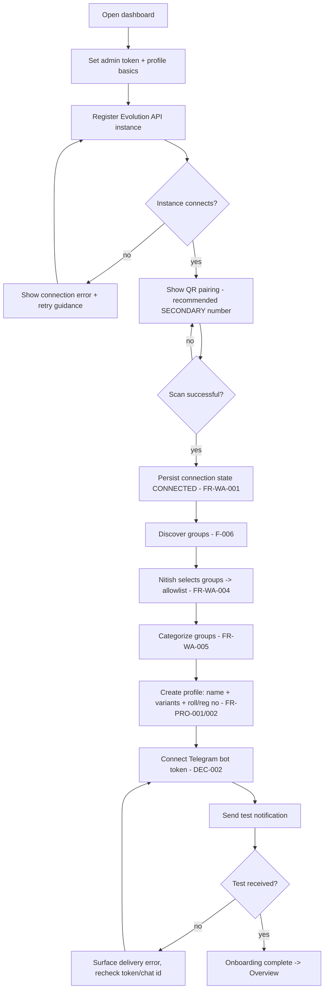
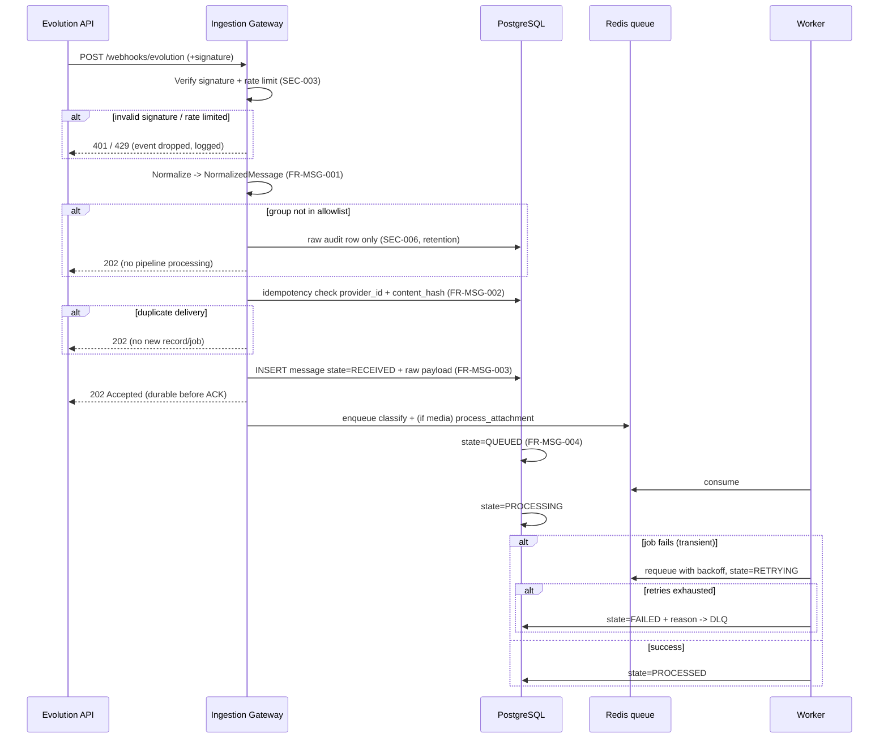
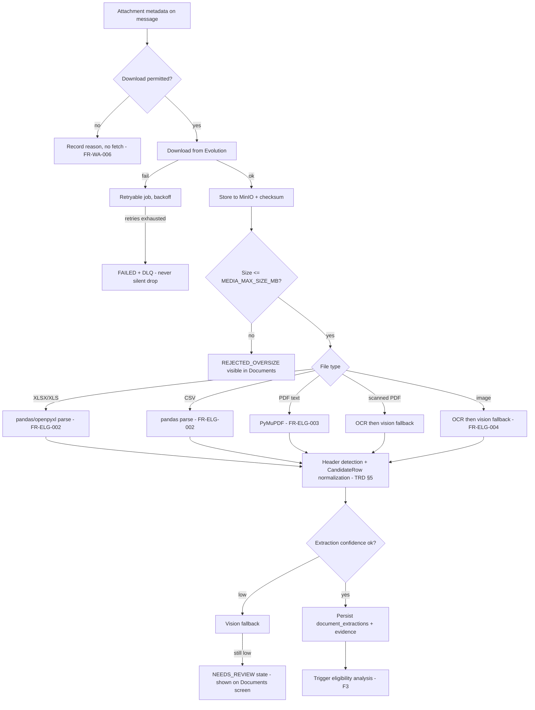
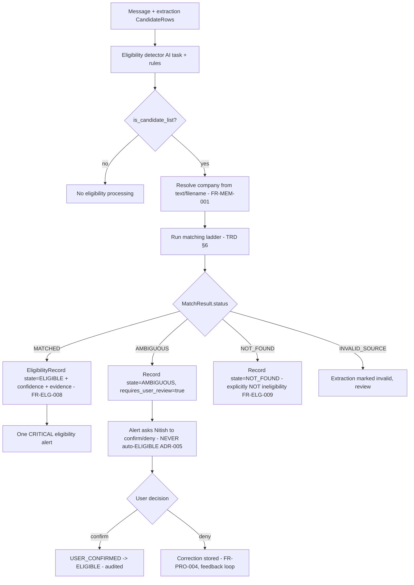
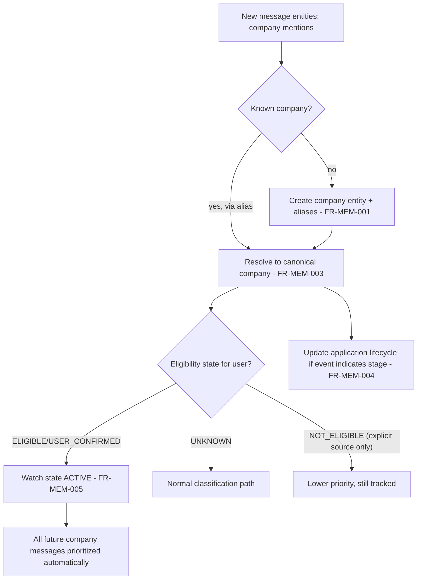
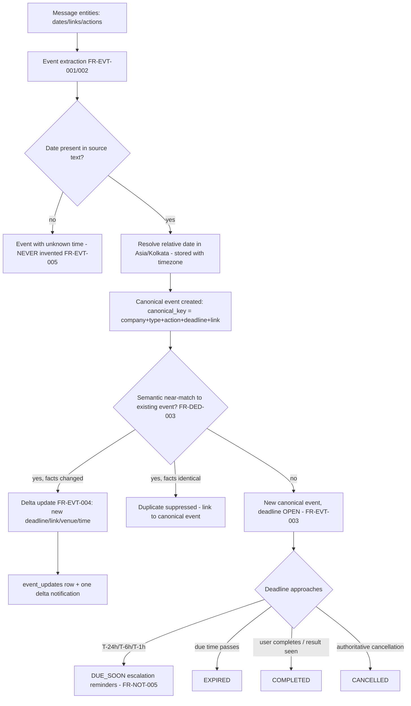
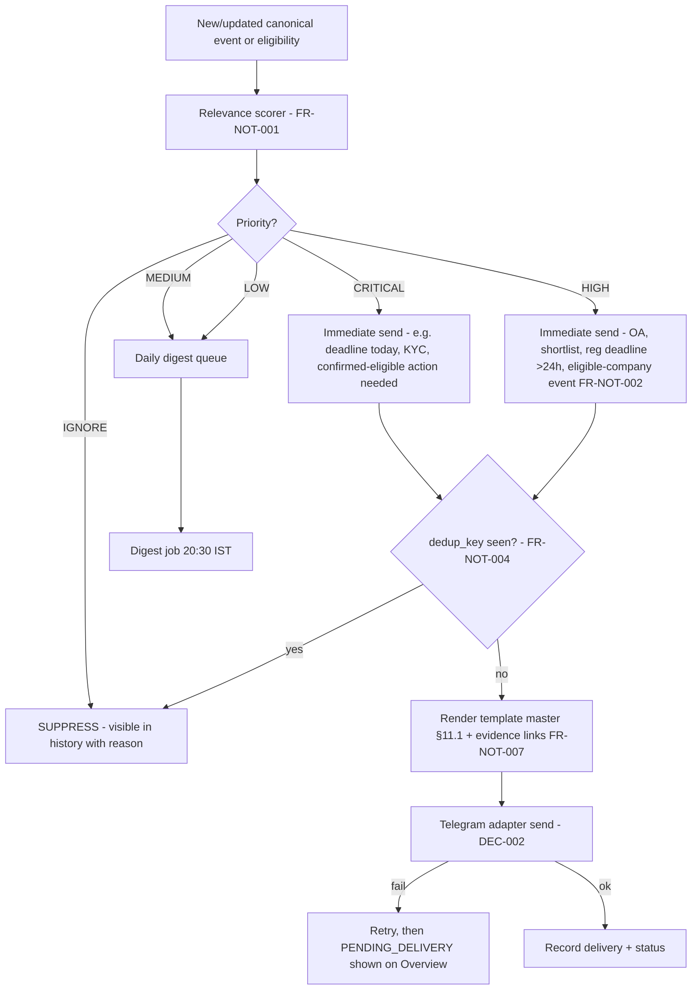
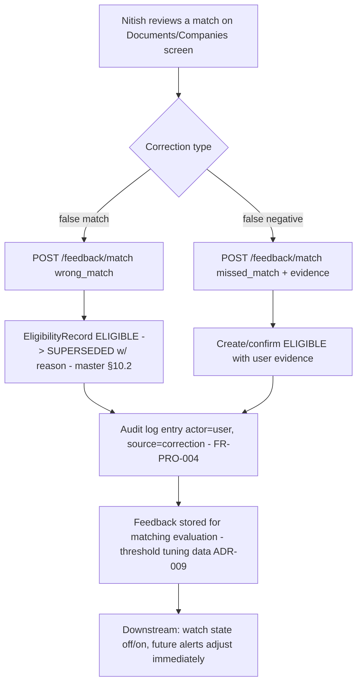
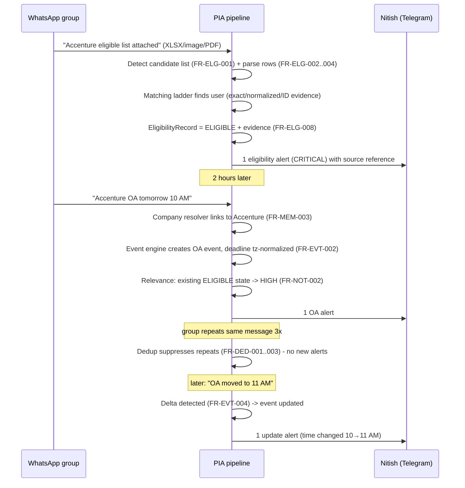

# 03 — App Flow

| | |
|---|---|
| Project | **Placement Intelligence Agent (PIA)** |
| Document | End-to-end runtime flows |
| Version | 1.0-draft |
| Date | 2026-09-05 |
| Depends on | `01_PRD.md` (hard), `02_TRD.md` (component names), `00_Master_Plan.md` |
| Consumed by | `04_UIUX_Brief.md`, `06_Implementation_Plan.md` |

**Conventions:** every flow lists error/retry branches (not just happy paths). State names come from the master state machines (§10.1–10.4). Component names come from 02_TRD §1.1.

---

## F0 — Onboarding (first-run setup)

| Step | Actor | Component | Action | Output / state |
|---|---|---|---|---|
| 1 | Nitish | Dashboard | First-run wizard | Settings seeded |
| 2 | Nitish | API | Register Evolution instance | `whatsapp_instances` row; connection state persisted (FR-WA-001) |
| 3 | Nitish | Evolution adapter | QR pairing (secondary number — DEC-003) | `CONNECTED`; reconnect failures surfaced |
| 4 | System | API | Group discovery + metadata persist (FR-WA-003) | Group registry rows |
| 5 | Nitish | Dashboard | Allowlist selection (FR-WA-004) + category (FR-WA-005) | Only selected groups ever reach AI pipeline (SEC-006) |
| 6 | Nitish | Dashboard | Profile: canonical name, aliases/misspellings, roll/reg/student ID (FR-PRO-001/002) | `candidate_profiles` + `identity_aliases` |
| 7 | Nitish | Dashboard | Telegram bot token + chat ID; test message (DEC-002) | Delivery confirmed before first real alert |

**Error branches:** instance unreachable → retryable status shown; QR timeout → re-pair loop; Telegram test failure → delivery error surfaced, onboarding blocked (alerts must not silently fail later).

---

## F1 — Message Ingestion (every WhatsApp event)

Key rules: response `202` only **after** durable persistence (NFR-001); 10 identical deliveries → exactly one logical message (FR-MSG-002 acceptance); every state transition queryable (FR-MSG-004); terminal `FAILED` always carries a visible reason (master §10.1).

---

## F2 — Media / Document Processing

Failure guarantees: failed downloads are retryable jobs, never silent drops (FR-WA-006); low-confidence extractions stop at `NEEDS_REVIEW` and never auto-match (ADR-005).

---

## F3 — Eligibility Detection & Matching (the core flow)

| Branch | Guarantee |
|---|---|
| MATCHED | Evidence chain: message → document → page/sheet/row (FR-ELG-008); one alert (dedup applies) |
| AMBIGUOUS | Structurally cannot become ELIGIBLE without user action (NFR-006) — same-name fixture test at P6 |
| NOT_FOUND | Distinct from NOT_ELIGIBLE; no negative claim (FR-ELG-009) |
| INVALID_SOURCE | Visible in Documents screen with failure reason |

---

## F4 — Company Memory Linkage

Acceptance echo: once Accenture is ELIGIBLE, "Accenture OA" resolves to the Accenture record and is auto-prioritized without manual re-subscription (FR-MEM-003/005).

---

## F5 — Event & Deadline Lifecycle

State machine (master §10.3): `DETECTED → ACTIVE → COMPLETED | UPDATED → ACTIVE | CANCELLED | EXPIRED`. Hallucination guard: validators reject any date string absent from source text (FR-EVT-005, ADR-004).

---

## F6 — Notification Decisioning

Escalation branch: a deadline moving to `DUE_SOON` re-enters this flow; dedup keys include the escalation window, so reminders are intentional, not spam (FR-NOT-005). Critical academic notices take the same CRITICAL path even with no company relation (FR-NOT-003).

---

## F7 — Daily Digest

1. Digest job runs at configured local hour (default 20:30 Asia/Kolkata).
2. Query canonical events updated since last digest with priority MEDIUM/LOW **not already delivered** (FR-NOT-006).
3. Summarizer AI task composes sections from **stored facts only** (validator rejects added facts — TRD §4.2 #6).
4. Sections: 🔥 urgent · 🏢 placement · 🎓 academic · 📌 tracked companies.
5. Render → Telegram → record delivery. Empty digest → suppressed (no "nothing today" noise) unless setting enabled.

---

## F8 — User Correction / Feedback

Corrections are reversible state transitions with full evidence; they also feed the fixture corpus for threshold evaluation (Q8).

---

## F9 — Dashboard Navigation (screen ↔ flow map)

| Screen (master §17) | Primary flows surfaced |
|---|---|
| Overview | F6 urgent items, today's deadlines (F5), recent updates, tracked companies |
| Companies | F4 lifecycle + eligibility state, latest event, next deadline |
| Timeline | F5 canonical event history (FR-DED-005) |
| Inbox | F1/F3 AI-filtered important messages with source evidence |
| Documents | F2 extractions, match results, NEEDS_REVIEW queue |
| Notifications | F6 delivered + suppressed with reasons, delivery status |
| Profile | F0 identity/aliases/documents |
| Settings | F0 groups, thresholds, notification windows, retention, provider config |
| Audit | F8 corrections, state changes, (future) action approvals |

---

## F10 — Flagship Golden End-to-End Scenario (master §20.2)

This single scenario exercises F1→F2→F3→F4→F5→F6 including dedup and delta — it is the P10/P11 capstone E2E test (06_Implementation_Plan §3).

---

## Traceability

| Flow | Requirement groups covered |
|---|---|
| F0 | FR-WA-001..005, FR-PRO-001/002, DEC-002/003 |
| F1 | FR-WA-002/006, FR-MSG-001..004, SEC-003/006, NFR-001/002 |
| F2 | FR-WA-006, FR-ELG-002..004, ADR-005 |
| F3 | FR-ELG-001..009, FR-MEM-001, FR-PRO-004, ADR-005 |
| F4 | FR-MEM-001..005 |
| F5 | FR-EVT-001..005, FR-DED-003/004, FR-NOT-005 |
| F6 | FR-NOT-001..004, FR-CLS-002, DEC-002, §11 policy |
| F7 | FR-NOT-006 |
| F8 | FR-PRO-004, FR-MEM-002, ADR-009 |
| F9 | Master §17 screens |
| F10 | Master §20.2 golden scenario |

## Open Questions
- Exact Evolution webhook payload fields affect F1 normalization mapping only — resolved at P1 (Q4).
