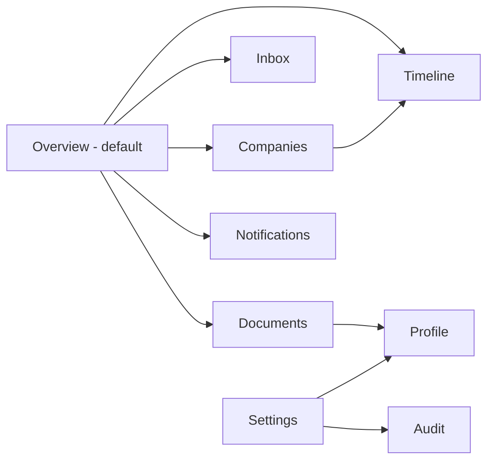

# 04 — UI/UX Brief

| | |
|---|---|
| Project | **Placement Intelligence Agent (PIA)** |
| Document | Dashboard & notification UX specification |
| Version | 1.0-draft |
| Date | 2026-09-05 |
| Depends on | `01_PRD.md` (hard), `03_App_Flow.md` (states/branches), `00_Master_Plan.md` |
| Consumed by | `06_Implementation_Plan.md` (P11) · frontend builder |

**Scope:** the React dashboard (9 screens, master §17) and the Telegram notification rendering. Telegram carries the mobile-first burden (DEC-002); the dashboard is desktop-first, usable at mobile widths.

---

## 1. Design Principles

1. **Personal relevance over volume.** The dashboard answers "what matters to me today", never "show me everything". Suppressed noise is visible but visually quiet (collapsed, gray, zero prominence by default).
2. **Evidence over confidence theater (SEC-009).** Every claim is rendered with its evidence type: **observed facts** (raw message text, list row, page) vs **AI interpretation** (extracted entity, match). A user can click any alert and reach the source in ≤ 2 clicks.
3. **Calm by default.** One accent color for "needs you", muted everything else. No red badges for informational items; red is reserved for CRITICAL deadlines.
4. **Trust through traceability.** Show *why* — every notification, match, and suppression exposes its reason and dedup decision (FR-NOT-007, FR-DED-005).
5. **Honest uncertainty.** AMBIGUOUS and low-confidence states are first-class UI states with explicit user actions (confirm/deny), never rendered as settled facts (ADR-005).
6. **Single-user, zero-chrome.** No onboarding marketing, no multi-user nav, no upsells. It's a cockpit, not a product landing page.

---

## 2. Information Architecture (9 screens, master §17)



| # | Screen | One-line purpose |
|---|---|---|
| 1 | **Overview** | Today's cockpit: urgent items, deadlines, recent updates, tracked companies |
| 2 | **Companies** | Per-company lifecycle, eligibility state, latest event, next deadline |
| 3 | **Timeline** | Chronological, source-backed canonical event history |
| 4 | **Inbox** | AI-filtered important messages with evidence |
| 5 | **Documents** | Processed lists: extractions, match results, review queue |
| 6 | **Notifications** | Delivered *and* suppressed alerts with reasons |
| 7 | **Profile** | Identity, aliases, academic attributes, documents |
| 8 | **Settings** | Groups, thresholds, notification windows, retention, provider config |
| 9 | **Audit** | State changes, corrections, (future) action approvals |

---

## 3. Per-Screen Specification

### 3.1 Overview (master §17 "must show": urgent items, today's deadlines, recent important updates, tracked companies)

```
┌────────────────────────────────────────────────────────────────────┐
│  PIA ● connected · last msg 14:32        [Overview][Companies]… ⚙ │
├────────────────────────────────────────────────────────────────────┤
│  🔴 NEEDS YOU NOW (2)                                              │
│  ┌──────────────────────────────────────────────────────────────┐ │
│  │ ⏰ Accenture OA — registration closes TODAY 18:00 IST        │ │
│  │ Why: you are ELIGIBLE (list, 03 Sep)  [View evidence →]      │ │
│  └──────────────────────────────────────────────────────────────┘ │
│  ┌──────────────────────────────────────────────────────────────┐ │
│  │ ⚠ 1 match needs review — "Rahul Sharma" ambiguous · TCS list │ │
│  │ [Confirm it's me] [Not me]                                    │ │
│  └──────────────────────────────────────────────────────────────┘ │
│                                                                    │
│  📅 TODAY & TOMORROW                        nothing else due 🌤    │
│  ▸ TCS KYC session — Thu 11:00 · venue: Seminar Hall 2            │
│                                                                    │
│  🏢 TRACKED COMPANIES (4)                                          │
│  Accenture ● ELIGIBLE   next: OA 11 Sep    │ Wipro ● WATCHING     │
│  Infosys  ● SUPERSEDED  —                  │ Deloitte ● UNKNOWN    │
│                                                                    │
│  🕒 RECENT UPDATES (last 24h)  ·  12 suppressed · see all →        │
└────────────────────────────────────────────────────────────────────┘
```

- **Primary actions:** act on review requests (confirm/deny), open evidence.
- "Needs you now" only contains CRITICAL items + pending AMBIGUOUS reviews — nothing else, ever.

### 3.2 Companies

- List → detail: company header with canonical name + aliases ("Accenture · also seen as *Accenture India*, *Acc*"), eligibility state badge + since-date + source link, **lifecycle stepper** (DISCOVERED → ELIGIBLE → REGISTRATION → OA → SHORTLISTED → INTERVIEW → SELECTED/REJECTED, FR-MEM-004), latest events, next deadline, full company timeline.
- Detail's timeline merges messages + extractions + notifications for that company, newest first.

### 3.3 Timeline

- Vertical canonical-event feed (FR-DED-005): each card shows event, updates chained underneath ("⏱ moved 10:00 → 11:00 · src"), and source links. Filters: company / event type / domain / date range.

### 3.4 Inbox

- AI-filtered important messages only (IGNORE-class chatter never renders here). Each row: priority chip, domain chip, one-line preview, **[Source]** link that expands the raw message + attachment. Delta-tagged rows show "update of event #…".

### 3.5 Documents

```
┌────────────────────────────────────────────────────────────────────┐
│  FILTERS: [All] [Needs review 2] [Matched] [Not found] [Failed]    │
├────────────────────────────────────────────────────────────────────┤
│  📄 accenture_eligible.xlsx · Placement Group · 03 Sep 14:02        │
│     412 rows · 6 cols · extractor xlsx-v1 · conf 0.98              │
│     ► MATCHED · method IDENTIFIER (roll 21CS1042) · conf 0.99      │
│       evidence: Sheet1, row 87 → [raw row] [source message]        │
├────────────────────────────────────────────────────────────────────┤
│  🖼 IMG_2041.png · Placement Group · 03 Sep 11:47                   │
│     OCR conf 0.71 → vision fallback · 96 rows                      │
│     ► AMBIGUOUS · 2 same-name candidates · [Review rows →]         │
│       evidence: page region rows 41, 58 · [source image]           │
├────────────────────────────────────────────────────────────────────┤
│  📄 wipro_shortlist.pdf · 02 Sep · NOT_FOUND (not ineligibility!)  │
└────────────────────────────────────────────────────────────────────┘
```

- The **review queue** is the screen's reason to exist: AMBIGUOUS/NEEDS_REVIEW items first, with side-by-side candidate rows vs profile identity and Confirm/Deny actions (F8).

### 3.6 Notifications

- Two tabs: **Delivered** / **Suppressed**. Every row shows priority emoji, title, channel status (sent/failed/pending), timestamp, and **why** ("duplicate of Accenture OA event", "below digest threshold") — suppression reasons are auditable facts (FR-NOT-004, master §17).

### 3.7 Profile

- Identity: canonical name, aliases/misspellings (chips, add/remove), roll/registration/student ID. Academic: CGPA, branch, batch, 10th/12th, backlogs. Documents: resume/certificates with access labels (FR-PRO-003). Change history link → Audit (FR-PRO-001).

### 3.8 Settings

- Groups (allowlist toggles + category, FR-WA-004/005), thresholds (fuzzy/ambiguous — displayed with their evaluation rationale per ADR-009, "set from 84-fixture corpus, P6"), notification windows (escalation T-24h/T-6h/T-1h), digest hour, retention days, provider config (LLM provider/model; `ACTION_AUTOMATION_ENABLED` shown locked **OFF** with the reason "MVP" — SEC-005), Evolution instance status + re-pair.

### 3.9 Audit

- Reverse-chron table: actor (system/user), action, entity, result, timestamp, correlation ID. Filterable. This is the trust ledger — no dashboard gloss (FR-PRO-004, SEC-004).

---

## 4. Evidence & Confidence Visualization (SEC-009 concrete patterns)

| Pattern | Where | Spec |
|---|---|---|
| **Status badges** | Documents, Companies, Overview | `MATCHED` (green) · `AMBIGUOUS` (amber) · `NOT_FOUND` (gray, tooltip: "absence ≠ rejection", FR-ELG-009) · `INVALID_SOURCE` (red) |
| **Match method chip** | next to status | `EXACT` / `NORMALIZED` / `IDENTIFIER` / `FUZZY` / `MODEL_REVIEW` + confidence number (0.00–1.00); confidence < 0.90 always renders the number, ≥ 0.90 may collapse to tooltip |
| **Evidence drawer** | every card's "View evidence" | Opens split view: left = extracted claim with confidence; right = raw source (message text, sheet row, PDF page with highlight, image with bbox overlay). Each evidence item is typed: 👁 **Observed** (fact) vs 🤖 **Interpreted** (AI, with rationale) — two distinct chips, never mixed styling |
| **Review invitation** | AMBIGUOUS cards | Explicit "this needs your confirmation" framing + Confirm/Not-me actions; no auto-dismiss |
| **Suppression ribbon** | Timeline, Notifications | "3 repeats suppressed · latest 14:02" — expandable to the duplicate messages |

---

## 5. Notification Template Rendering (Telegram, master §11.1)

**CRITICAL (immediate):**

```
🔴 Accenture — OA REGISTRATION CLOSES TODAY

What changed: Registration window for the Accenture online
assessment closes today.
Why it matters: You are ELIGIBLE (found on the 03 Sep list,
roll 21CS1042).
Deadline: Today, 18:00 IST
Action: Complete registration on the portal now.
Source: Placement Group · msg · accenture_eligible.xlsx
open dashboard for evidence →
```

**HIGH (immediate):**

```
🟠 Accenture — OA scheduled

What changed: OA moved from 10:00 to 11:00, 11 Sep.
Why it matters: You are ELIGIBLE for Accenture.
When: 11 Sep, 11:00 IST (was 10:00)
Action: Update your plan; bring college ID.
Source: Placement Group · msg (update of earlier event)
```

**MEDIUM/LOW (digest, 20:30 IST):**

```
📬 PIA Daily — 04 Sep
🔥 Urgent: nothing new
🏢 Placement: Wipro shortlist out (not on list → NOT_FOUND);
   Infosys registration opened, deadline 12 Sep
🎓 Academic: Mid-sem exam schedule posted (exam 09 Sep)
📌 Tracked: Accenture — no change
```

Rules: priority emoji from §11 table; **Why it matters** always states the concrete memory link (never "we think you'll like this"); confidence line appears only when ambiguity exists; every alert ends with an evidence deep link. No marketing voice, no exclamation stacking.

---

## 6. Tone & Voice

- Concise, factual, calm. Verb-first actions ("Complete registration", "Confirm the match").
- Never alarmist; CRITICAL urgency comes from the deadline fact, not from adjectives.
- Never overclaims: "found on the list (roll match, 0.99)" not "congratulations, you're shortlisted!". Suppression/dedup language is plain: "same announcement as earlier — not re-sending."

---

## 7. States

| State | Spec |
|---|---|
| **Empty** | Per-screen friendly zero-state + the one action that fills it (e.g., Documents: "No lists processed yet — connect groups in Settings"); never a blank page |
| **Loading** | Skeletons matching final layout; no spinners-only screens |
| **Error** | Inline red-bordered block with error class + retry button; never a dead end |
| **Stale connection (DEC-003)** | Global header dot: ● connected / ● reconnecting / ○ **silent since <timestamp>** — silence is *surfaced*, not assumed to mean "no updates" (leaner §7 risk) |
| **Degraded AI** | If LLM provider unreachable: rule-based classification continues; affected cards show "AI enrichment pending" chip |
| **Pending delivery** | Notification that failed → also pinned to Overview until delivered (backup path, TRD §8) |

---

## 8. Accessibility

- WCAG 2.1 AA: all priority/status color pairs meet 4.5:1 (tokens below chosen accordingly); color is never the only signal — every badge pairs color + icon + text.
- Full keyboard navigation; visible focus rings; logical tab order (Overview → urgent card actions first).
- Screen-reader labels: confidence rendered as text ("confidence 0.99"), evidence chips announced as "observed evidence" / "AI interpretation", status badges announce full state ("matched, identifier method").
- Motion: none beyond subtle transitions; respects `prefers-reduced-motion`.

---

## 9. Responsive Behavior

- Breakpoints: desktop-first ≥ 1024 px (full 3-zone layouts); 768–1023 px (2-column collapse, drawer navigation); < 768 px (single column, bottom tab bar with Overview/Companies/Documents/Notifications/More).
- Evidence drawers become full-screen sheets on mobile.
- Telegram notifications are the primary mobile surface; dashboard links open the exact evidence view (deep links, FR-NOT-007).

---

## 10. Suggested Design Tokens (starter set)

```css
/* priority scale — all AA on dark or light surface */
--p-critical: #D64545;  /* + ⏰/🔴 icon + bold text */
--p-high:     #E07B39;
--p-medium:   #B7A14A;
--p-low:      #7A8699;
--p-ignore:   #5A6472;

/* match status */
--status-matched:   #2E8B57;
--status-ambiguous: #C9860B;
--status-notfound:  #7A8699;
--status-invalid:   #D64545;

/* evidence typing (SEC-009) */
--evidence-observed:     #2E6FDB;  /* 👁 chip */
--evidence-interpreted:  #8A5FC9;  /* 🤖 chip */

/* neutrals */
--bg: #F7F8FA; --surface: #FFFFFF; --border: #E3E7EC;
--text-1: #1A222D; --text-2: #5A6472;

/* type scale (1.25 ratio) */
--fs-xs: 12px; --fs-sm: 14px; --fs-base: 16px; --fs-lg: 20px; --fs-xl: 25px; --fs-2xl: 31px;
/* font: Inter (UI) + JetBrains Mono (IDs, hashes, timestamps) */

/* spacing: 4px base grid; radius: 8px cards, 999px chips; elevation: 2-level max */
```

---

## Traceability

| Section | Covers |
|---|---|
| §1 Principles | Master §4; SEC-009; DEC-003 |
| §2 IA + §3 Screens | Master §17 (all 9 screens, "must show" honored) |
| §4 Evidence/confidence | Master §8.2, §10.2; FR-ELG-007/009; ADR-005; SEC-009 |
| §5 Notifications | Master §11/§11.1; FR-NOT-002/005/006/007; DEC-002 |
| §7 States | FR-WA-001; DEC-003; TRD §8/§10 |
| §8 Accessibility | WCAG AA commitment (new, consistent with principles) |
| §10 Tokens | Consistent with §4/§5 patterns |

## Open Questions
- Theme preference (light/dark) — tokens above are light-first; dark variants derived at build time.
- Any preference for component library (e.g., shadcn/ui, MUI) — brief is library-agnostic.
