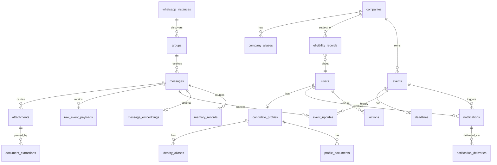

# 05 — Backend Schema (PostgreSQL)

| | |
|---|---|
| Project | **Placement Intelligence Agent (PIA)** |
| Document | Authoritative database schema (source of truth for Alembic migrations) |
| Version | 1.0-draft |
| Date | 2026-09-05 |
| Depends on | `02_TRD.md` (hard: idempotency/dedup/notification designs), `01_PRD.md` (FR references), `00_Master_Plan.md` DEC-005/006/009 |
| Consumed by | `06_Implementation_Plan.md` (F-002) · P0 migrations |

Target: **PostgreSQL 15+** (ADR-002). pgvector optional, never authoritative (ADR-003).

---

## 1. Conventions

- **PKs:** `uuid` default `gen_random_uuid()` (pgcrypto / built-in v15+).
- **Timestamps:** every table gets `created_at timestamptz not null default now()` and `updated_at timestamptz not null default now()` (trigger or ORM-managed). **All instants stored UTC**; rendered in Asia/Kolkata at the edge (`APP_TIMEZONE`, master §22). *Shorthand: DDL blocks below write `created_at/updated_at timestamptz NOT NULL DEFAULT now()` on one line to mean exactly these two columns.*
- **Naming:** snake_case; singular table names; `_at` suffix for timestamps, `_id` for FKs.
- **Soft delete:** only for user-authored entities (`candidate_profiles`, `groups` config rows) via `deleted_at timestamptz null`; everything else is state-machine driven — history is never destroyed (only retention-expired per SEC-007).
- **Audit fields:** mutating endpoints write `audit_logs` rows; FKs use `ON DELETE RESTRICT` unless stated.
- **Money/limits:** n/a. **Text:** `text` (not varchar-n) everywhere.
- **Enums:** Postgres enums created via Alembic (values below); adding values is a migration — never in-place in code.

---

## 2. Enums & State Machines

```sql
CREATE TYPE group_category AS ENUM ('PLACEMENT','ACADEMIC','ADMINISTRATIVE','GENERAL','OTHER');
CREATE TYPE instance_status AS ENUM ('PENDING','QR_PENDING','CONNECTED','RECONNECTING','DISCONNECTED','LOGGED_OUT','ERROR');
CREATE TYPE message_state AS ENUM ('RECEIVED','VALIDATED','QUEUED','PROCESSING','PROCESSED','FAILED','RETRYING');          -- §10.1
CREATE TYPE attachment_state AS ENUM ('PENDING','DOWNLOADING','DOWNLOADED','PROCESSING','PROCESSED','FAILED','REJECTED_OVERSIZE','NEEDS_REVIEW');
CREATE TYPE msg_domain AS ENUM ('PLACEMENT','ACADEMIC','EXAMINATION','ADMINISTRATIVE','EVENT','GENERAL','UNKNOWN');          -- FR-CLS-001
CREATE TYPE importance AS ENUM ('CRITICAL','HIGH','MEDIUM','LOW','IGNORE');                                                 -- FR-CLS-002
CREATE TYPE eligibility_state AS ENUM ('UNKNOWN','MATCHED','NOT_FOUND','AMBIGUOUS','USER_CONFIRMED','ELIGIBLE','NOT_ELIGIBLE','EXPIRED','SUPERSEDED'); -- §10.2
CREATE TYPE match_status AS ENUM ('MATCHED','NOT_FOUND','AMBIGUOUS','INVALID_SOURCE');                                      -- §8.2
CREATE TYPE match_method AS ENUM ('EXACT','NORMALIZED','IDENTIFIER','FUZZY','MODEL_REVIEW');                                -- §8.2
CREATE TYPE company_watch AS ENUM ('NONE','WATCHING','MUTED');
CREATE TYPE event_type AS ENUM ('REGISTRATION','FORM','KYC','OA','EXAM','INTERVIEW','SHORTLIST','RESULT','VENUE','DOCUMENT_SUBMISSION','JOINING','OTHER'); -- FR-EVT-001
CREATE TYPE event_status AS ENUM ('DETECTED','ACTIVE','COMPLETED','CANCELLED','EXPIRED');                                   -- §10.3 (UPDATED is modeled via event_updates + status ACTIVE)
CREATE TYPE deadline_state AS ENUM ('OPEN','DUE_SOON','EXPIRED','CANCELLED','COMPLETED');                                   -- FR-EVT-003
CREATE TYPE notification_priority AS ENUM ('CRITICAL','HIGH','MEDIUM','LOW','IGNORE');
CREATE TYPE notification_status AS ENUM ('PENDING','QUEUED','SENT','FAILED','PENDING_DELIVERY','SUPPRESSED');               -- FR-NOT-004
CREATE TYPE memory_scope AS ENUM ('COMPANY','EVENT','PROFILE','GROUP','GENERAL');
CREATE TYPE action_status AS ENUM ('PROPOSED','WAITING_APPROVAL','APPROVED','EXECUTING','SUCCEEDED','REJECTED','EXPIRED','FAILED'); -- §10.4 (future)
CREATE TYPE job_state AS ENUM ('QUEUED','STARTED','RETRYING','SUCCEEDED','FAILED','DEAD_LETTERED');
```

**Allowed transitions (enforced in the state-transition layer, validated by tests — not DB triggers):**

| Enum | Legal transitions |
|---|---|
| `message_state` | RECEIVED→VALIDATED→QUEUED→PROCESSING→PROCESSED · PROCESSING→RETRYING→PROCESSING · RETRYING/PROCESSING→FAILED (terminal, requires reason) |
| `eligibility_state` | UNKNOWN→MATCHED→ELIGIBLE · UNKNOWN→NOT_FOUND · UNKNOWN→AMBIGUOUS→USER_CONFIRMED→ELIGIBLE · ELIGIBLE→SUPERSEDED/EXPIRED · AMBIGUOUS→NOT_FOUND (user denies). **No AMBIGUOUS→ELIGIBLE edge exists** (ADR-005) |
| `event_status` | DETECTED→ACTIVE→COMPLETED/CANCELLED/EXPIRED · ACTIVE→ACTIVE (delta update) |
| `deadline_state` | OPEN→DUE_SOON→COMPLETED/EXPIRED · OPEN/DUE_SOON→CANCELLED |
| `action_status` | PROPOSED→WAITING_APPROVAL→APPROVED→EXECUTING→SUCCEEDED/FAILED · WAITING_APPROVAL→REJECTED/EXPIRED |

---

## 3. Full DDL

### 3.1 Users & profile

```sql
CREATE TABLE users (
  id                       uuid PRIMARY KEY DEFAULT gen_random_uuid(),
  email                    text UNIQUE,
  display_name             text NOT NULL,
  timezone                 text NOT NULL DEFAULT 'Asia/Kolkata',
  notification_preferences jsonb NOT NULL DEFAULT '{}',        -- digest hour, escalation windows, mute flags
  deleted_at               timestamptz,
  created_at               timestamptz NOT NULL DEFAULT now(),
  updated_at               timestamptz NOT NULL DEFAULT now()
);

CREATE TABLE candidate_profiles (
  id                  uuid PRIMARY KEY DEFAULT gen_random_uuid(),
  user_id             uuid NOT NULL UNIQUE REFERENCES users(id),
  canonical_name      text NOT NULL,
  roll_number         text,
  registration_number text,
  student_id          text,
  branch              text, batch text, cgpa numeric(4,2),
  tenth_percent       numeric(5,2), twelfth_percent numeric(5,2),
  backlog_count       smallint DEFAULT 0,
  other_attributes    jsonb NOT NULL DEFAULT '{}',
  created_at/updated_at timestamptz NOT NULL DEFAULT now()
);
-- SEC-002: roll/registration/student id columns encrypted app-side (AES-256-GCM) before write

CREATE TABLE identity_aliases (          -- FR-PRO-002
  id          uuid PRIMARY KEY DEFAULT gen_random_uuid(),
  profile_id  uuid NOT NULL REFERENCES candidate_profiles(id) ON DELETE CASCADE,
  alias       text NOT NULL,             -- stored normalized (FR-ELG-005 rules)
  kind        text NOT NULL DEFAULT 'name_variant',   -- name_variant | misspelling | former_name
  created_at  timestamptz NOT NULL DEFAULT now(),
  UNIQUE (profile_id, alias)
);
CREATE INDEX idx_identity_aliases_alias ON identity_aliases (alias);   -- matching-ladder lookups

CREATE TABLE profile_documents (         -- FR-PRO-003
  id            uuid PRIMARY KEY DEFAULT gen_random_uuid(),
  profile_id    uuid NOT NULL REFERENCES candidate_profiles(id),
  kind          text NOT NULL,           -- resume | certificate | academic_proof
  storage_key   text NOT NULL,           -- MinIO key (SSE on)
  access_level  text NOT NULL DEFAULT 'private',
  deleted_at    timestamptz,
  created_at    timestamptz NOT NULL DEFAULT now(), updated_at timestamptz NOT NULL DEFAULT now()
);
```

### 3.2 Connector & groups

```sql
CREATE TABLE whatsapp_instances (        -- FR-WA-001, master §9
  id             uuid PRIMARY KEY DEFAULT gen_random_uuid(),
  instance_key   text NOT NULL UNIQUE,   -- Evolution instance name/id
  provider       text NOT NULL DEFAULT 'evolution',
  status         instance_status NOT NULL DEFAULT 'PENDING',
  secret_ref     text NOT NULL,          -- pointer to secret store entry (SEC-001)
  last_seen_at   timestamptz,            -- 'silence is detected' health signal (DEC-003)
  last_error     text,
  created_at/updated_at timestamptz NOT NULL DEFAULT now()
);

CREATE TABLE groups (                    -- FR-WA-003/004/005
  id                uuid PRIMARY KEY DEFAULT gen_random_uuid(),
  provider_group_id text NOT NULL UNIQUE, -- JID
  name              text NOT NULL,
  category          group_category NOT NULL DEFAULT 'OTHER',
  enabled           boolean NOT NULL DEFAULT false,   -- allowlist flag (SEC-006)
  priority          smallint NOT NULL DEFAULT 5,
  participant_meta  jsonb,
  deleted_at        timestamptz,
  created_at/updated_at timestamptz NOT NULL DEFAULT now()
);
CREATE INDEX idx_groups_enabled ON groups (enabled) WHERE enabled;    -- ingestion hot path
```

### 3.3 Messages, attachments, idempotency, raw payloads

```sql
CREATE TABLE messages (                  -- FR-MSG-001..004
  id                  uuid PRIMARY KEY DEFAULT gen_random_uuid(),
  provider_message_id text NOT NULL,
  group_id            uuid NOT NULL REFERENCES groups(id),
  sender_id           text NOT NULL,
  sender_name         text,
  sent_at             timestamptz NOT NULL,
  text                text,
  content_hash        text NOT NULL,     -- SHA-256 of normalized text (FR-DED-001)
  image_phash         text,              -- DEC-009 (populated for images)
  domain              msg_domain,        -- set by classification
  importance          importance,
  classification      jsonb,             -- full classifier output + confidence + rationale
  processing_state    message_state NOT NULL DEFAULT 'RECEIVED',
  failure_reason      text,
  correlation_id      uuid NOT NULL,     -- §14 traceability
  retention_expires_at timestamptz,      -- SEC-007 (raw payload lifecycle)
  received_at         timestamptz NOT NULL DEFAULT now(),
  created_at/updated_at timestamptz NOT NULL DEFAULT now(),
  UNIQUE (provider_message_id, group_id) -- FR-MSG-002 / NFR-002: idempotency anchor
);
CREATE INDEX idx_messages_group_sent ON messages (group_id, sent_at DESC);      -- GET /messages, Timeline
CREATE INDEX idx_messages_state    ON messages (processing_state) WHERE processing_state NOT IN ('PROCESSED','FAILED');
CREATE INDEX idx_messages_correlation ON messages (correlation_id);
CREATE INDEX idx_messages_content_hash ON messages (content_hash, sent_at DESC); -- near-dup window scan

CREATE TABLE attachments (               -- FR-WA-006
  id               uuid PRIMARY KEY DEFAULT gen_random_uuid(),
  message_id       uuid NOT NULL REFERENCES messages(id),
  mime_type        text NOT NULL,
  file_name        text,
  storage_key      text,                 -- null until downloaded
  checksum         text,                 -- SHA-256
  size_bytes       bigint,
  processing_state attachment_state NOT NULL DEFAULT 'PENDING',
  failure_reason   text,
  retention_expires_at timestamptz,
  created_at/updated_at timestamptz NOT NULL DEFAULT now()
);
CREATE INDEX idx_attachments_state ON attachments (processing_state) WHERE processing_state IN ('PENDING','DOWNLOADING','PROCESSING','FAILED');

CREATE TABLE raw_event_payloads (        -- FR-MSG-003 / SEC-007
  id           uuid PRIMARY KEY DEFAULT gen_random_uuid(),
  message_id   uuid REFERENCES messages(id) ON DELETE SET NULL,
  source       text NOT NULL DEFAULT 'evolution',
  payload      jsonb NOT NULL,
  retention_expires_at timestamptz NOT NULL,
  created_at   timestamptz NOT NULL DEFAULT now()
);

CREATE TABLE idempotency_keys (          -- FR-MSG-002 generic support (webhooks, jobs)
  key         text PRIMARY KEY,          -- e.g. 'evol:{instance}:{event_id}'
  fingerprint text NOT NULL,
  entity_ref  text,
  created_at  timestamptz NOT NULL DEFAULT now()
);
```

### 3.4 Document intelligence

```sql
CREATE TABLE document_extractions (      -- master §9, TRD §5
  id                 uuid PRIMARY KEY DEFAULT gen_random_uuid(),
  attachment_id      uuid NOT NULL REFERENCES attachments(id),
  extractor          text NOT NULL,      -- 'xlsx-v1' | 'pdf-v1' | 'ocr-v1' | 'vision-v1'
  extractor_version  text NOT NULL,
  raw_text           text,
  structured_payload jsonb,              -- CandidateRow[] (master §8.1)
  confidence         numeric(4,3),
  evidence           jsonb,              -- [{page|sheet, row|region, quote}]
  needs_review       boolean NOT NULL DEFAULT false,
  created_at         timestamptz NOT NULL DEFAULT now()
);
CREATE INDEX idx_document_extractions_attachment ON document_extractions (attachment_id);
```

### 3.5 Companies & eligibility

```sql
CREATE TABLE companies (                 -- FR-MEM-001
  id             uuid PRIMARY KEY DEFAULT gen_random_uuid(),
  canonical_name text NOT NULL,
  normalized_key text NOT NULL UNIQUE,   -- normalized canonical name for resolution
  watch_state    company_watch NOT NULL DEFAULT 'NONE',  -- FR-MEM-005
  lifecycle_stage text,                  -- FR-MEM-004: DISCOVERED..SELECTED/REJECTED
  first_seen_at  timestamptz,
  created_at/updated_at timestamptz NOT NULL DEFAULT now()
);

CREATE TABLE company_aliases (
  id          uuid PRIMARY KEY DEFAULT gen_random_uuid(),
  company_id  uuid NOT NULL REFERENCES companies(id) ON DELETE CASCADE,
  alias       text NOT NULL,
  UNIQUE (company_id, alias)
);
CREATE INDEX idx_company_aliases_alias ON company_aliases (alias);   -- FR-MEM-003 resolution

CREATE TABLE eligibility_records (       -- FR-ELG-008/009, FR-MEM-002, §10.2
  id                 uuid PRIMARY KEY DEFAULT gen_random_uuid(),
  user_id            uuid NOT NULL REFERENCES users(id),
  company_id         uuid NOT NULL REFERENCES companies(id),
  state              eligibility_state NOT NULL DEFAULT 'UNKNOWN',
  match_status       match_status,
  match_method       match_method,
  confidence         numeric(4,3),
  requires_user_review boolean NOT NULL DEFAULT false,
  source_message_id  uuid REFERENCES messages(id),
  source_document_id uuid REFERENCES document_extractions(id),
  detected_at        timestamptz NOT NULL DEFAULT now(),
  superseded_by_id   uuid REFERENCES eligibility_records(id),
  correction_note    text,               -- FR-PRO-004
  created_at/updated_at timestamptz NOT NULL DEFAULT now()
);
CREATE INDEX idx_eligibility_user_company ON eligibility_records (user_id, company_id, detected_at DESC);  -- GET /eligibility, FR-NOT-001
CREATE INDEX idx_eligibility_review ON eligibility_records (requires_user_review) WHERE requires_user_review;
```

### 3.6 Events, updates, deadlines

```sql
CREATE TABLE events (                    -- FR-EVT-001..004, ADR-006
  id              uuid PRIMARY KEY DEFAULT gen_random_uuid(),
  company_id      uuid REFERENCES companies(id),
  group_id        uuid REFERENCES groups(id),
  type            event_type NOT NULL,
  status          event_status NOT NULL DEFAULT 'DETECTED',
  canonical_key   text NOT NULL UNIQUE,  -- hash(company, type, action, deadline, link) — dedup unit
  title           text,
  current_payload jsonb NOT NULL DEFAULT '{}',  -- latest links/venue/time/details
  start_at        timestamptz,
  deadline_at     timestamptz,           -- null = unknown, never invented (FR-EVT-005)
  timezone        text NOT NULL DEFAULT 'Asia/Kolkata',  -- FR-EVT-002
  created_at/updated_at timestamptz NOT NULL DEFAULT now()
);
CREATE INDEX idx_events_deadline ON events (deadline_at) WHERE status = 'ACTIVE';   -- GET /deadlines, Overview
CREATE INDEX idx_events_company   ON events (company_id, created_at DESC);          -- GET /companies/{id}

CREATE TABLE event_updates (             -- FR-EVT-004, FR-DED-005
  id                uuid PRIMARY KEY DEFAULT gen_random_uuid(),
  event_id          uuid NOT NULL REFERENCES events(id),
  source_message_id uuid REFERENCES messages(id),
  delta             jsonb NOT NULL,      -- {field: {from, to}}
  detected_at       timestamptz NOT NULL DEFAULT now()
);
CREATE INDEX idx_event_updates_event ON event_updates (event_id, detected_at);

CREATE TABLE deadlines (                 -- FR-EVT-003
  id              uuid PRIMARY KEY DEFAULT gen_random_uuid(),
  event_id        uuid NOT NULL UNIQUE REFERENCES events(id) ON DELETE CASCADE,
  due_at          timestamptz NOT NULL,
  state           deadline_state NOT NULL DEFAULT 'OPEN',
  reminder_policy jsonb NOT NULL DEFAULT '{"windows_hours":[24,6,1]}',  -- FR-NOT-005 (config-driven)
  reminders_sent  jsonb NOT NULL DEFAULT '[]',
  created_at/updated_at timestamptz NOT NULL DEFAULT now()
);
CREATE INDEX idx_deadlines_state_due ON deadlines (state, due_at);
```

### 3.7 Notifications

```sql
CREATE TABLE notifications (             -- FR-NOT-001..007
  id               uuid PRIMARY KEY DEFAULT gen_random_uuid(),
  user_id          uuid NOT NULL REFERENCES users(id),
  event_id         uuid REFERENCES events(id),
  message_id       uuid REFERENCES messages(id),
  eligibility_id   uuid REFERENCES eligibility_records(id),
  priority         notification_priority NOT NULL,
  status           notification_status NOT NULL DEFAULT 'PENDING',
  reason           text NOT NULL,        -- relevance rationale (FR-NOT-001)
  dedup_key        text NOT NULL,        -- hash(canonical_event_id, material_state_hash) FR-NOT-004
  payload          jsonb NOT NULL,       -- rendered template fields (§11.1)
  evidence_refs    jsonb NOT NULL DEFAULT '[]',  -- [{kind:'message'|'document'|'row', ref}] FR-NOT-007
  scheduled_for    timestamptz,
  sent_at          timestamptz,
  created_at/updated_at timestamptz NOT NULL DEFAULT now(),
  UNIQUE (dedup_key)                    -- one notification per canonical event state (NFR-005)
);
CREATE INDEX idx_notifications_user_time ON notifications (user_id, created_at DESC);
CREATE INDEX idx_notifications_pending ON notifications (status, scheduled_for) WHERE status IN ('PENDING','QUEUED','PENDING_DELIVERY');

CREATE TABLE notification_deliveries (   -- delivery history, TRD §8
  id               uuid PRIMARY KEY DEFAULT gen_random_uuid(),
  notification_id  uuid NOT NULL REFERENCES notifications(id),
  channel          text NOT NULL,        -- 'telegram' | 'email' | 'whatsapp_self'
  status           text NOT NULL,        -- 'sent' | 'failed'
  error            text,
  attempted_at     timestamptz NOT NULL DEFAULT now()
);
CREATE INDEX idx_deliveries_notification ON notification_deliveries (notification_id);
```

### 3.8 Memory, AI logs, actions (future), jobs, audit

```sql
CREATE TABLE memory_records (            -- master §9
  id         uuid PRIMARY KEY DEFAULT gen_random_uuid(),
  scope      memory_scope NOT NULL,
  subject    text NOT NULL,              -- e.g. 'company:accenture'
  predicate  text NOT NULL,              -- e.g. 'eligible_since'
  object_value jsonb NOT NULL,
  source_message_id uuid REFERENCES messages(id),
  confidence numeric(4,3),
  valid_from timestamptz, valid_until timestamptz,
  created_at timestamptz NOT NULL DEFAULT now()
);
CREATE INDEX idx_memory_subject ON memory_records (scope, subject);

CREATE TABLE ai_call_logs (              -- DEC-006, §14 — NO message content stored
  id              uuid PRIMARY KEY DEFAULT gen_random_uuid(),
  correlation_id  uuid NOT NULL,
  task            text NOT NULL,         -- classifier | entity_extractor | eligibility_detector | ...
  provider        text NOT NULL, model   text NOT NULL,
  latency_ms      integer NOT NULL,
  prompt_tokens   integer, completion_tokens integer,
  validation      text NOT NULL,         -- 'ok' | 'repaired' | 'invalid'
  retention_expires_at timestamptz,     -- SEC-007 (model artifacts)
  created_at      timestamptz NOT NULL DEFAULT now()
);
CREATE INDEX idx_ai_calls_task_time ON ai_call_logs (task, created_at DESC);

CREATE TABLE actions (                   -- §10.4 — FUTURE (P13+); schema defined now, unused in MVP
  id                uuid PRIMARY KEY DEFAULT gen_random_uuid(),
  user_id           uuid NOT NULL REFERENCES users(id),
  type              text NOT NULL,       -- 'form_draft' | 'kyc_reminder' | ...
  target            text,
  payload           jsonb NOT NULL DEFAULT '{}',
  risk_level        text NOT NULL DEFAULT 'low',
  status            action_status NOT NULL DEFAULT 'PROPOSED',
  approval_required boolean NOT NULL DEFAULT true,   -- SEC-004/005, ADR-008
  created_at/updated_at timestamptz NOT NULL DEFAULT now()
);

CREATE TABLE job_records (               -- §14 observability
  id              uuid PRIMARY KEY DEFAULT gen_random_uuid(),
  queue           text NOT NULL,
  job_type        text NOT NULL,
  state           job_state NOT NULL DEFAULT 'QUEUED',
  attempts        smallint NOT NULL DEFAULT 0,
  max_attempts    smallint NOT NULL DEFAULT 5,
  error_class     text, last_error text,
  correlation_id  uuid,
  started_at timestamptz, finished_at timestamptz,
  created_at      timestamptz NOT NULL DEFAULT now()
);
CREATE INDEX idx_jobs_state ON job_records (queue, state);

CREATE TABLE dead_letter_queue (         -- §14: permanently failed jobs
  id             uuid PRIMARY KEY DEFAULT gen_random_uuid(),
  job_record_id  uuid REFERENCES job_records(id),
  queue          text NOT NULL, job_type text NOT NULL,
  payload        jsonb NOT NULL,
  error_class    text NOT NULL, last_error text,
  correlation_id uuid,
  moved_at       timestamptz NOT NULL DEFAULT now(),
  resolved_at    timestamptz
);

CREATE TABLE audit_logs (                -- SEC-004, FR-PRO-001/004, master §9
  id             uuid PRIMARY KEY DEFAULT gen_random_uuid(),
  actor          text NOT NULL,          -- 'system' | 'user:<id>' | 'worker:<name>'
  action         text NOT NULL,          -- 'eligibility.state_change' | 'profile.update' | ...
  entity_type    text NOT NULL, entity_id uuid,
  result         text NOT NULL,          -- 'ok' | 'rejected' | 'error'
  metadata       jsonb NOT NULL DEFAULT '{}',  -- from→to states, rule ids, reasons
  correlation_id uuid,
  created_at     timestamptz NOT NULL DEFAULT now()
);
CREATE INDEX idx_audit_entity ON audit_logs (entity_type, entity_id, created_at DESC);
CREATE INDEX idx_audit_actor  ON audit_logs (actor, created_at DESC);
```

### 3.9 Optional pgvector (ADR-003 — never authoritative)

```sql
CREATE EXTENSION IF NOT EXISTS vector;
CREATE TABLE message_embeddings (
  message_id  uuid PRIMARY KEY REFERENCES messages(id) ON DELETE CASCADE,
  embedding   vector(1024) NOT NULL,
  model       text NOT NULL,
  created_at  timestamptz NOT NULL DEFAULT now()
);
-- used ONLY for "find similar messages" / future conversational search (P12).
-- Eligibility and deadlines are NEVER decided from embeddings (hard rule, ADR-003).
```

---

## 4. Idempotency Design (FR-MSG-002 / NFR-002)

1. **Message anchor:** `UNIQUE (provider_message_id, group_id)` on `messages` — insert uses `ON CONFLICT DO NOTHING`; affected-rows = 0 ⇒ duplicate delivery: no job enqueued, existing message returned.
2. **Generic webhooks/jobs:** `idempotency_keys.key` = `'{provider}:{instance}:{event_id}'`; fingerprint (payload hash) detects *same key, different content* (logged, not silently merged).
3. **Notification anchor:** `UNIQUE (dedup_key)` — a repeated alert attempt for the same canonical event state is a DB-level no-op, guaranteeing "three reminders → one notification" (FR-DED-003, ADR-006) even under race conditions.
4. **Media anchor:** `attachments.checksum` unique per message; re-delivered media does not re-parse.

## 5. Retention (SEC-007)

`retention_expires_at` on `raw_event_payloads`, `messages` (raw payload linkage), `attachments` (objects in MinIO), `ai_call_logs`. Daily worker deletes expired rows + MinIO objects; normalized/derived facts (eligibility, events) are **not** auto-deleted. Defaults: raw messages 90 d, documents 365 d (Q7 — configurable).

## 6. ERD



## 7. Index Justification (query → index)

| API/query (master §16) | Index |
|---|---|
| `GET /messages` (group+time filter) | `idx_messages_group_sent` |
| `GET /deadlines` (upcoming) | `idx_events_deadline` + `idx_deadlines_state_due` |
| `GET /companies/{id}` timeline | `idx_events_company` |
| `GET /eligibility` | `idx_eligibility_user_company` |
| Overview "needs review" | `idx_eligibility_review` (partial) |
| Notification dedup race-safety | `UNIQUE(dedup_key)` |
| Ingestion duplicate check | `UNIQUE(provider_message_id, group_id)` + `idx_messages_content_hash` |
| Processing-state dashboards | partial indexes on `messages`/`attachments`/`job_records` |
| Audit views | `idx_audit_entity`, `idx_audit_actor` |

## 8. Migration Strategy

- **Alembic** with `autogenerate` off in CI (explicit migrations only); every migration reviewed for reversibility (`downgrade()` implemented "where practical" per master DoD; data migrations forward-only with a documented backout).
- Enum changes: additive `ALTER TYPE ... ADD VALUE` only in MVP; renames forbidden (IDs stable, master-plan convention).
- **Seeds/fixtures:** `tests/fixtures/` loads deterministic rows (users, profile "Nitish", 3 groups, sample messages, the P5/P6 eligibility-list corpus) via a `seed` command — never manual inserts.
- Naming: `YYYYMMDD_HHMM_<slug>.py`; one logical change per migration (master DoD: no unrelated features bundled).

## 9. Traceability

| Schema area | Covers |
|---|---|
| §2 enums/state machines | Master §10.1–10.4, FR-EVT-003, §8.2 |
| §3.1 users/profile | FR-PRO-001..003, SEC-002 |
| §3.2 connector/groups | FR-WA-001..005, DEC-003, SEC-006 |
| §3.3 messages | FR-MSG-001..004, FR-DED-001, DEC-009, SEC-003/007, NFR-002 |
| §3.4 extractions | Master §8/§8.1, FR-ELG-002..004 |
| §3.5 companies/eligibility | FR-ELG-005..009, FR-MEM-001..005, FR-PRO-004, ADR-005 |
| §3.6 events/deadlines | FR-EVT-001..005, FR-DED-003/004, FR-NOT-005, ADR-006 |
| §3.7 notifications | FR-NOT-001..007, DEC-002, NFR-005 |
| §3.8 memory/AI/actions/jobs/DLQ/audit | Master §9, §12, §14, §10.4, SEC-004/005, DEC-006 |
| §4 idempotency | FR-MSG-002, NFR-002, FR-DED-003 |
| §5 retention | SEC-007, §22 |
| §6 ERD / §7 indexes | Master §9, §16 |
