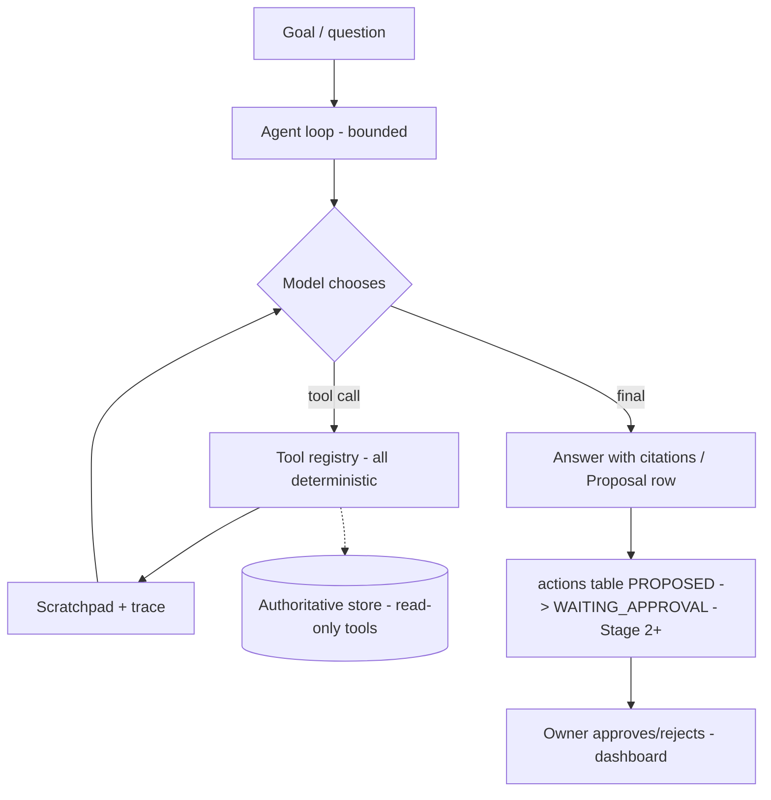

# 09 — Agentic Evolution Plan (ADR-011: "Agent" architecture for PIA)

| | |
|---|---|
| Project | **Placement Intelligence Agent (PIA)** |
| Document | Decision record + staged plan: evolving PIA into a tool-using agent |
| Date | 2026-09-06 |
| Decision | **ADOPTED — narrow agentic architecture** (tool-using loop + proposal workflow); the deterministic core is explicitly preserved |
| Status | Stage 1 approved for build; Stages 2–4 require owner go-ahead per stage |
| Depends on | `00_Master_Plan.md` (ADR-003/004/005/008, DEC-003/008, SEC-005), `02_TRD.md` §4, P0–P12 implementation |

---

## 1. The question this ADR answers

PIA today is an LLM-augmented pipeline: deterministic code owns every decision;
LLMs are invoked at fixed points (classification, entity extraction, vision,
answer phrasing) and their output is schema-validated, rule-overridable, and
never state-mutating (ADR-004). The owner asked: should PIA become a true
**AI agent** — an LLM that decides what to do next, calls tools, and works
toward goals in a loop?

## 2. Decision

**Yes — narrowly.** PIA adopts a *tool-using agent runtime* for two capability
areas where a fixed pipeline genuinely falls short, and permanently excludes it
from the areas where deterministic code outperforms any model:

| Capability | Agentic? | Why |
|---|---|---|
| Complex multi-hop questions ("compare this week's deadlines and tell me what to do first") | **YES — Stage 1** | Requires the model to look things up mid-answer; fixed retrieval cannot |
| Proactive review ("what should I act on today?") with proposals | **YES — Stage 2** | Judgment over open-ended state; output is a proposal, never an action |
| Handling novel/odd message formats | **YES — Stage 2/3**, with human review | Agent proposes a parse/action; user approves |
| Eligibility matching, dedup, deadlines, notification priority | **NO — permanent** | Deterministic code is more reliable than any model on these; the product's core promise depends on them (ADR-005 posture, FR-EVT-005) |
| Autonomous execution without approval | **NO — permanent** | ADR-008, SEC-005: actions require approval; KYC automation excluded forever (DEC-008); no outbound WhatsApp (DEC-003) |

The one-line rule: **the agent decides what to look at and what to propose;
code decides what is true and what changes.**

## 3. Architecture: invert the control flow

Today: `pipeline → LLM at fixed points → validated output → pipeline continues`.
Agentic: `goal → model picks a tool → code executes it → result appended to the
model's scratchpad → model picks again → … → final answer/proposal` (ReAct loop,
bounded).

PIA's deterministic pipeline becomes the agent's **tool registry** — the
reliability discipline is preserved because the tools ARE the pipeline, and the
model only sequences them.

## 4. Stages

### Stage 1 — Tool-using answer agent (read-only) — APPROVED

- `pia_worker/agent/tools.py`: registry of read-only tools, each wrapping
  existing deterministic code:
  `search_messages(query)`, `get_eligibility(company?)`,
  `get_events(company?/timeframe?)`, `get_company_timeline(company)`,
  `get_deadlines(state?)`, `get_document(id)`, `get_profile()`.
- `pia_worker/agent/loop.py`: bounded ReAct runtime — max steps
  (`AGENT_MAX_STEPS`, default 6), token budget, scratchpad, full trace into a
  new `agent_traces` table.
- `NIMProvider` gains function-calling (tools param) with a JSON
  action-selection fallback (the established structured-output pattern) —
  free-tier flakiness handled by the same degradation ladder as everywhere:
  fallback = the existing P12 single-shot retrieval, then raw evidence.
- API: `POST /api/v1/agent/ask` returning answer + citations + trace.
- Dashboard: Ask screen shows the reasoning trace (tool calls + results).
- Regression set: ~15 goals with expected tool sequences in CI.

### Stage 2 — Proactive reviewer (proposes, never acts) — needs owner go-ahead

Daily agent run after the digest with a review goal over read tools + one new
tool: `propose_action(type, payload)` → `actions` row (`PROPOSED →
WAITING_APPROVAL`). Owner approves/rejects on the dashboard. Deterministic
executors (Stage 3) are the ONLY path to real-world effect. Examples:
deadline-vs-inactivity proposals, NA-field verification proposals, KYC session
reminders (DEC-008: reminders allowed, automation never).

### Stage 3 — Approved-action executors — needs owner go-ahead

Deterministic executors behind approved proposals (Telegram follow-up, create
reminder, re-run parse, event field correction). Agent prepares/sequences;
executors are fixed code; every run audited. `ACTION_AUTOMATION_ENABLED`
revisited per-capability with an ADR each.

### Stage 4 — Reactive per-message judgment (optional) — needs owner go-ahead

Agent judges notify-now/digest/ignore where keyword rules are weakest, with
rule veto and confidence thresholds. Least necessary; the fixed pipeline
already performs this well.

## 5. Hard boundaries (non-negotiable, inherited)

1. ADR-003: retrieval/embeddings never authoritative for eligibility/deadlines.
2. ADR-004: model output is input to deterministic validators; tools compute
   facts, the model only selects and phrases.
3. ADR-005/NFR-006: no AMBIGUOUS → ELIGIBLE without the owner.
4. ADR-008/SEC-005: nothing reaches the real world without approval;
   `ACTION_AUTOMATION_ENABLED` stays false per-capability until an ADR says
   otherwise.
5. DEC-003: no outbound WhatsApp — the agent gets no such tool.
6. DEC-008: KYC automation permanently excluded — reminders only.
7. Degradation ladder everywhere: tool-calling → JSON action fallback →
   P12 single-shot → raw evidence. A downed NIM degrades the agent; it never
   breaks the pipeline.

## 6. Known costs (accepted)

- Latency/cost: an agent answer is 3–6 LLM calls vs 1; on the flaky NIM free
  tier this means frequent fallbacks (observed live: 5–6 consecutive failures).
  Mitigation: step budgets, deterministic fallback, optional paid key later.
- Nondeterminism: identical questions may take different tool paths. Mitigation:
  the regression set gates CI on tool-sequence sanity, traces are logged.
- Model churn: embedding/completion models retire (observed 2026-09-06).
  Mitigation: model IDs are config; migrations resize storage when needed.

## 7. Is this right for PIA's use case? (the honest verdict, recorded)

Yes — **as an interface and reviewer, not as a brain.** The product's critical
path (never miss an eligibility hit or a deadline; never mis-identify the user)
is solved deterministically at ~100% reliability, and agentifying it would add
nondeterminism exactly where Nitish needs determinism — a lost alert is a lost
opportunity. But the *interaction* layer benefits enormously: real questions are
multi-hop ("compare X and Y", "what should I do today") and unbounded, and only
a tool-using loop can serve them. Hence: agent at the edges, pipeline at the
core. If NIM reliability becomes the limiting factor, the agent runtime is
provider-agnostic (SEC-008) — a paid key or self-hosted model upgrades it
without architectural change.

## 8. Traceability

| Item | Source |
|---|---|
| Hybrid rule (LLM interprets, code decides) | ADR-004, DEC-006 |
| Read-only retrieval boundary | ADR-003 |
| Approval-gated actions, capability profile | ADR-008, SEC-004 |
| Automation kill switch | SEC-005, master §22 |
| Read-only WhatsApp, no KYC automation | DEC-003, DEC-008 |
| actions table + lifecycle | 05_Backend_Schema §3.8, master §10.4 |
| Degradation ladder precedent | P3 (rules > LLM), P12 (evidence fallback) |

## 9. Open questions

- Q-A1: Stage 2 cadence (daily post-digest vs on-demand)?
- Q-A2: should agent traces be owner-visible in the dashboard Audit screen
  (recommended) or a separate screen?
- Q-A3: paid NIM tier vs self-hosted model if flakiness blocks Stage 1 UX?
